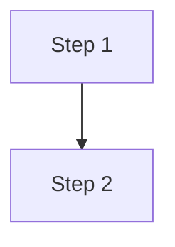

# Documentation Guide

**Document ID:** guide-docs-guide
**Status:** Active
**Date:** 2026-01-15
**Last Updated:** 2026-04-06
**Owner:** Eugene Goncharov
**Assistance:** AI-assisted drafting (human-reviewed)
**Category:** Guide

---
**CRITICAL:** This guide applies to ALL documents in `docs/`, not just ADR.

**For AI Agents:** See [AI-AGENT-DOCUMENTATION-GUIDE](AI-AGENT-DOCUMENTATION-GUIDE.md) for complete step-by-step workflow instructions.

## Single Source of Truth

**`stories/viewers/docs/docs-registry.ts` is the SINGLE SOURCE OF TRUTH for all non-ADR documentation.**

All non-ADR documentation metadata must be defined here FIRST:
- Unique `id` for each document
- `path` relative to `docs/` root
- `title` from markdown header
- `category` (adr, architecture, workflows, tasks, steps, other)
- `exportName` (optional, for Storybook exports)
- `storybookId` (optional, Storybook story id for link mapping)
- `aliases` (optional, for renamed files)

**ADR exception:** ADR metadata lives in `stories/viewers/docs/adr-list-data.ts` (single source of truth) and is imported into the registry for link mapping and Storybook navigation. Only ADR guide documents ([README](workflows/README.md), [AGENT-GUIDE](adr/AGENT-GUIDE.md), TEMPLATE) should be registered manually.

## Excluded Directories

The following directories are intentionally excluded from Storybook registry and link validation warnings:
- `docs/dirty/`
- `docs/tasks/`
- `docs/steps/`

These are working notes and drafts. They can be referenced by links, but they should not be registered in `docs-registry.ts`.

## Documentation Sections

Docs are organized by section. Each section can have an overview story that lists all documents from the registry.

**Current sections:**
- `Docs/ADR` - Historical decisions
- `Docs/Architecture` - Current rules and standards
- `Docs/Workflows` - How to work with the system
- `Docs/Tokens` - Token references and tooling

**Overview pages (recommended):**
- If a section has more than a couple documents, create an overview story that renders a list from the registry.
- Use the shared list viewer (`DocSectionListViewer`) to keep the UI consistent across sections.

## File Naming Standards

### ADR (Architectural Decision Records):
- **Markdown:** `docs/adr/ADR-XXXX-description.md`
- **Stories:** `stories/docs/adr/ADR-XXXX-description.stories.tsx`
- **Examples:**
  - `docs/adr/ADR-0001-react-aria-headless.md`
  - `stories/docs/adr/ADR-0001-react-aria-headless.stories.tsx`
- **Export names:** camelCase (e.g., `ReactAriaasHeadlessAccessibilityFoundation`)

### Architecture документы:
- **Markdown:** `docs/architecture/ARCH-category-XXX-description.md`
- **Stories:** `stories/docs/architecture/ARCH-category-XXX-description.stories.tsx`
- **Examples:**
  - `docs/architecture/ARCH-tokens-001-color-system-architecture-rules.md`
  - `stories/docs/architecture/ARCH-tokens-001-color-system-architecture-rules.stories.tsx`
- **Export names:** PascalCase с префиксом (e.g., `ARCHTokens001ColorSystemArchitectureRules`)

### Будущие секции:
Следуют **Architecture паттерну** с соответствующими префиксами:
- `WORK-*` для workflows
- `GUIDE-*` для guides
- `TOKEN-*` для tokens
- И т.д.

**Все секции должны иметь consistent именование файлов и структуру.**

## Workflow for New Document

### Step 1: Add to docs-registry.ts FIRST

```typescript
// In stories/viewers/docs/docs-registry.ts
{
  id: 'category-document-name',
  path: 'category/document-name.md',
  title: 'Document Title',
  category: 'category',
  storybookId: 'docs-category--document-name'
}
```

**ID Rules:**
- Use kebab-case
- Prefix with category (e.g., `arch-`, `workflow-`)
- Example: `arch-accessibility`, `workflow-adr`

### Step 2: Create Document

Create the markdown file at the path specified in registry.

### Step 3: Validate Links

```bash
npm run docs:validate
```

This checks:
- ✅ All links point to existing files
- ✅ All linked files are registered in registry
- ✅ No broken cross-references
- ✅ Storybook story ids in the registry resolve to real story exports

## Storybook Doc Stories

**Default pattern (DocViewer):**
```typescript
import type { Meta, StoryObj } from '@storybook/react';
import { DocViewer } from '../../viewers/docs/DocViewer';

const meta: Meta = {
  title: 'Docs/Architecture',
  parameters: { layout: 'fullscreen' }
};

export default meta;
type Story = StoryObj;

export const AccessibilityReference: Story = {
  name: 'Accessibility Reference',
  render: () => (
    <DocViewer markdownPath="/docs/architecture/ARCH-accessibility-001-accessibility-reference.md" />
  )
};
```

**Overview list pattern (DocSectionListViewer):**
```typescript
import { DocSectionListViewer } from '../../viewers/docs/DocSectionListViewer';
import { docsRegistry } from '../../viewers/docs/docs-registry';

const architectureDocs = docsRegistry.filter(doc => doc.path.startsWith('architecture/'));

export const Overview: Story = {
  name: 'Architecture Overview',
  render: () => (
    <DocSectionListViewer title="Architecture Documentation" docs={architectureDocs} />
  )
};
```

## Workflow for Renaming/Moving Document

1. **Update docs-registry.ts:**
   ```typescript
   {
     id: 'category-document-name',
     path: 'category/new-name.md', // Updated path
     title: 'Document Title',
     category: 'category',
     aliases: ['category/old-name.md'] // Add old path as alias
   }
   ```

2. **Rename/move the file**

3. **Update all links** in other documents (or use aliases for backward compatibility)

4. **Validate:**
   ```bash
   npm run docs:validate
   ```

## Cross-Reference Links

When linking between documents in different directories:

```markdown
- [Document Title](../category/document-name.md)
```

**Note:** The example above uses placeholder paths. Replace `category` and `document-name` with actual directory and file names.

**Path resolution:**
- `./file.md` - Same directory
- `../category/file.md` - Parent directory, then category
- `../../category/file.md` - Two levels up, then category

**Validation:**
- ✅ Target file exists
- ✅ Target is registered in docs-registry.ts
- ✅ Link path is correct

## Storybook Link Mapping

`DocViewer` uses `docs-registry.ts` to map markdown links to Storybook story routes.

For any doc that has a Storybook story:
- Add `storybookId` to its registry entry
- Use the Storybook story id format, for example: `docs-architecture--accessibility-reference`

**Navigation/open behavior (mandatory):**
- Internal documentation links that resolve to a registered Storybook document open in the current tab and keep Storybook shell navigation.
- External links and links to files not registered in Storybook open in a new tab and are rendered with external-link styling.
- In markdown, always write normal relative links to source `.md` files. Do not write `?path=/story/...` manually.

However, ADR guide documents ([README](workflows/README.md).md, [AGENT-GUIDE](adr/AGENT-GUIDE.md).md, TEMPLATE.md) must be manually registered.

## Mermaid Diagrams (All Docs)

**Recommended rules:**
- Prefer `graph TD` for vertical flow (more readable in docs).
- Use `stroke-width:2px` (hyphenated, with unit).
- Use quotes for labels with spaces: `A["Label with spaces"]`.

**ADR overrides:** ADRs have stricter diagram rules (orientation, sizing, typography). See `docs/adr/README.md`.

**Optional max width:**


## Images and Assets

Place images next to the markdown file and reference them with relative paths:
```markdown

```

`npm run docs:copy` will copy docs assets into `public/docs/` for Storybook.

## ADR Notes (Section-Specific)

ADR documents are automatically registered from `adr-list-data.ts`. You don't need to manually add them to `docs-registry.ts`.
ADR guide documents ([README](workflows/README.md).md, [AGENT-GUIDE](adr/AGENT-GUIDE.md).md, TEMPLATE.md) still require manual registry entries.

## Common Mistakes

### ❌ DON'T:
- Create document before adding to `docs-registry.ts`
- Use incorrect relative paths in links
- Forget to update registry when renaming files
- Skip validation before committing

### ✅ DO:
- Always update `docs-registry.ts` FIRST
- Always run `npm run docs:validate` after changes
- Use correct relative paths for cross-directory links
- Add aliases when renaming files

## Quick Checklist

When creating/modifying document:

- [ ] Updated `docs-registry.ts` with document entry
- [ ] Created/updated markdown file
- [ ] Ran `npm run docs:validate` (no broken links)
- [ ] Verified links work correctly
- [ ] Verified link behavior: registered docs open same-tab, external/unregistered open new-tab
- [ ] Checked cross-references are valid

## Troubleshooting

**Broken link error:**
1. Check target file exists at resolved path
2. Verify link path is correct (relative to source file)
3. Check if target is registered in `docs-registry.ts`

**Unregistered file warning:**
1. Add file to `docs-registry.ts`
2. Run validation again

**Cross-directory link not working:**
1. Verify relative path is correct
2. Use `../` to go up one directory level
3. Example: From `workflows/adr-workflow.md` to `adr/ADR-0001.md` → `../adr/ADR-0001.md`

## ADR Integration (Registry + Validation)

ADR documents are automatically included in the registry from `adr-list-data.ts`. The validation system:
- Parses ADR entries from `adr-list-data.ts`
- Maps filenames from `adr-filename-map.ts`
- Validates all ADR cross-references
- Checks links between ADR and other documents

**See also:**
- [`docs/adr/AGENT-GUIDE.md`](adr/AGENT-GUIDE.md) - ADR-specific guide
- [`docs/workflows/adr-workflow.md`](workflows/WORKFLOW-001-adr-workflow.md) - ADR workflow
