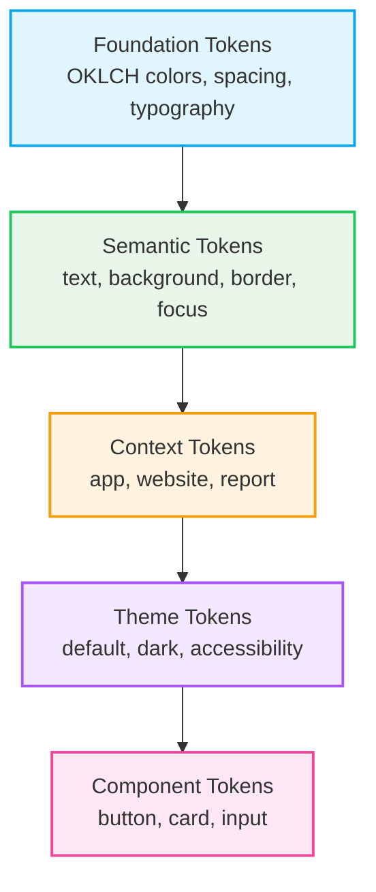
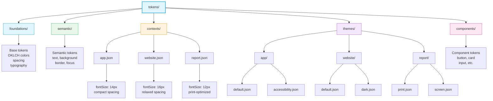

# ADR-0023: Token Organization - Context and Theme Separation

**Status:** Accepted  
**Date:** 2025-12-26  
**Owner:** Eugene Goncharov  
**Assistance:** AI-assisted drafting (human-reviewed)  
**Related:**  
- [ADR-0017](./ADR-0017-layered-token-architecture-contexts-and-themes.md) — Layered Token Architecture for Contexts and Themes  
- [ADR-0014](./ADR-0014-color-model-tonal-scales-and-contextual-architecture.md) — Color Model, Tonal Scales, and Contextual Architecture  
- [ADR-0015](./ADR-0015-token-first-contract-layer-and-renderer-agnostic-model.md) — Token-First Contract Layer and Renderer-Agnostic Model

---

## Context

The UI system serves multiple contexts (application shell, website/CMS, reports) with different visual requirements. Each context may have multiple themes (default, dark, accessibility). The previous architecture mixed context-specific and theme-specific tokens in a single `tokens/themes/` structure, making it unclear which tokens belong to contexts versus themes.

This mixing created several problems:

1. **Unclear Separation**: Context-specific tokens (like `fontSize: 14px` for app) were stored alongside theme-specific tokens (like color overrides)
2. **Architectural Confusion**: The file structure didn't match the conceptual separation outlined in ADR-0017
3. **Maintenance Difficulty**: Adding new contexts or themes required understanding which tokens should go where
4. **Platform Export Issues**: Exporting to platforms like Figma required complex logic to separate context from theme

The goal is to establish a clear, maintainable file structure that reflects the conceptual separation: **contexts define environment constraints**, while **themes define visual identity within those constraints**.

---

## Decision

I decided to separate contexts and themes into distinct token directories with clear responsibilities:

### File Structure

```
tokens/
  foundations/          # Base tokens (OKLCH colors, spacing, typography)
  semantic/            # Semantic tokens (text, background, border, focus)
  contexts/            # NEW: Context-specific overrides
    app.json           # App context: fontSize: 14px, compact spacing
    website.json       # Website context: fontSize: 16px, relaxed spacing
    report.json        # Report context: fontSize: 12px, print-optimized
  themes/              # REFACTORED: Only theme-specific overrides
    app/
      default.json     # Default theme for app context
      accessibility.json # Accessibility theme for app context
    website/
      default.json     # Default theme for website context
      dark.json        # Dark theme for website context
    report/
      print.json       # Print theme for report context
      screen.json      # Screen theme for report context
  components/          # Component tokens (button, card, input, etc.)
```

### Token Resolution Order



### Directory Hierarchy



### Context Responsibilities

**Contexts** define environment constraints and defaults:

- **`app`**: Application shell environment
  - Compact spacing for dense UIs
  - Smaller font sizes (14px base)
  - Standard component sizing
  
- **`website`**: CMS/Website environment
  - Relaxed spacing for content
  - Larger font sizes (16px base)
  - Content-optimized component sizing
  
- **`report`**: Print/Report environment
  - Print-optimized spacing
  - Smaller font sizes (12px base)
  - Print-safe color defaults

### Theme Responsibilities

**Themes** define visual identity within a context:

- **`default`**: Standard appearance
- **`dark`**: Dark mode variant (if applicable)
- **`accessibility`**: High contrast variant
- **`print`**: Print-optimized variant (for reports)
- **`screen`**: Screen-optimized variant (for reports)

---

## Rationale

### Clear Separation of Concerns

Separating contexts from themes makes the architecture more intuitive:
- Developers understand that contexts define "where" (environment)
- Themes define "how it looks" (visual identity)
- This separation matches how designers (human or AI-assisted design tools) think about the system

### Maintainability

- Adding a new context: Create `contexts/new-context.json`
- Adding a new theme: Create `themes/context-name/new-theme.json`
- No confusion about which tokens belong where

### Platform Compatibility

- **CSS**: Can generate separate selectors for contexts and themes
- **Figma**: Can create separate modes for context+theme combinations
- **Other Tools**: Can resolve tokens for specific context+theme pairs

### Alignment with ADR-0017

This structure directly implements the layered architecture described in ADR-0017:
- Foundation → Semantic → Context → Theme → Component
- Each layer has a clear, dedicated directory

---

## Consequences

### Positive

- **Clarity**: File structure matches conceptual model
- **Maintainability**: Easy to add new contexts or themes
- **Platform Support**: Easier to export to different platforms
- **Developer Experience**: Clear mental model for token organization

### Trade-offs

- **Migration Required**: Existing tokens need to be reorganized
- **Build Script Updates**: Style Dictionary formats need to read both `contexts/` and `themes/`
- **Documentation**: Need to document which tokens belong in contexts vs themes

### Implementation Requirements

1. Create `tokens/contexts/` directory
2. Migrate context-specific tokens from `tokens/themes/*/default.json` to `tokens/contexts/*.json`
3. Keep only theme-specific overrides in `tokens/themes/`
4. Update Style Dictionary formats to read both directories
5. Update CSS generation to create separate selectors for contexts and themes

---

## Explicit Rules

1. **Contexts** contain environment-specific defaults (fontSize, spacing, component sizing)
2. **Themes** contain visual identity overrides (colors, shapes, decorative elements)
3. Contexts are **mutually exclusive** - an element belongs to one context
4. Themes are **context-specific** - each theme belongs to a specific context
5. Token resolution always follows: Foundation → Semantic → Context → Theme → Component

---

## Examples

### Context Token Example

**`tokens/contexts/app.json`**:
```json
{
  "eui": {
    "typography": {
      "base": {
        "fontSize": {
          "$value": "14px",
          "$type": "dimension"
        }
      }
    }
  }
}
```

### Theme Token Example

**`tokens/themes/website/dark.json`**:
```json
{
  "eui": {
    "color": {
      "background": {
        "base": {
          "$value": "{eui.color.neutral.900}",
          "$type": "color"
        }
      },
      "text": {
        "primary": {
          "$value": "{eui.color.neutral.50}",
          "$type": "color"
        }
      }
    }
  }
}
```

---

## Notes

This ADR establishes the file structure. The implementation details for CSS generation, Figma export, and nested context support are documented in:
- [ADR-0024](./ADR-0024-css-layer-strategy-context-priority.md) — CSS Layer Strategy for Context Priority
- [ADR-0025](./ADR-0025-figma-variables-integration-strategy.md) — Figma Variables Integration Strategy

