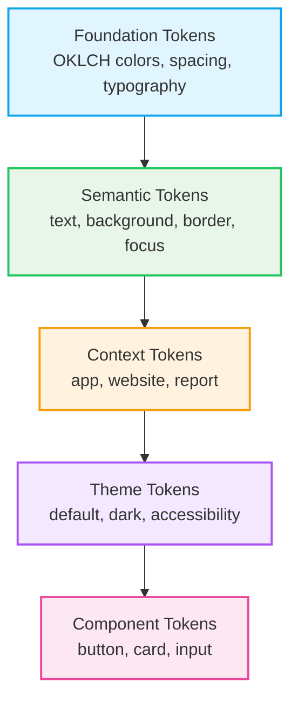
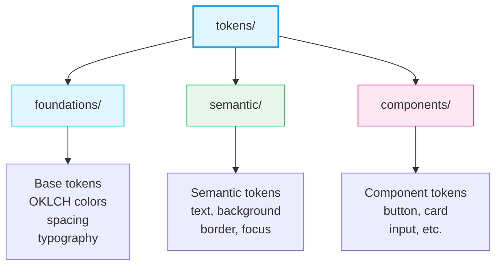
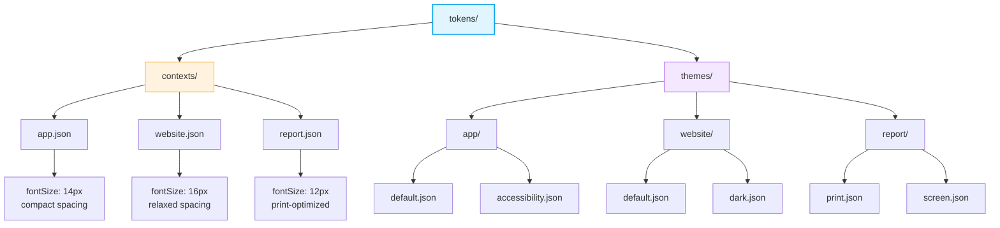

# ADR-0023: Token Organization - Context and Theme Separation

**Status:** Accepted (Partially Implemented)

**Date:** 2025-12-26

**Last Updated:** 2026-01-08

**Owner:** Eugene Goncharov

**Assistance:** AI-assisted drafting (human-reviewed)
**Related:**
- [ADR-0017](./ADR-0017-layered-token-architecture-contexts-and-themes.md) — Layered Token Architecture for Contexts and Themes
- [ADR-0014](./ADR-0014-color-model-tonal-scales-and-contextual-architecture.md) — Color Model, Tonal Scales, and Contextual Architecture
- [ADR-0015](./ADR-0015-token-first-contract-layer-and-renderer-agnostic-model.md) — Token-First Contract Layer and Renderer-Agnostic Model
- [ADR-0026](./ADR-0026-app-default-color-positioning.md) — App-Default Color Positioning and Semantic Token Optimization
- [Component CSS Architecture](../architecture/component-css-architecture.md) — Component CSS Implementation Rules

---

## Context

The UI system serves multiple contexts (application shell, website/CMS, reports) with different visual requirements. Each context may have multiple themes (default, dark, accessibility). The previous architecture mixed context-specific and theme-specific tokens in a single `tokens/themes/` structure, making it unclear which tokens belong to contexts versus themes.

This mixing created several problems:

1. **Unclear Separation**: Context-specific tokens (like `fontSize: 14px` for app) were stored alongside theme-specific tokens (like color overrides)
2. **Architectural Confusion**: The file structure didn't match the conceptual separation outlined in ADR-0017
3. **Maintenance Difficulty**: Adding new contexts or themes required understanding which tokens should go where
4. **Platform Export Issues**: Exporting to platforms like Figma required complex logic to separate context from theme

The goal is to establish a clear, maintainable file structure that reflects the conceptual separation: **contexts define environment constraints**, while **themes define visual identity within those constraints**.

---

## Decision

I decided to separate contexts and themes into distinct token directories with clear responsibilities.

**Note:** This ADR describes the initial separation. The structure was later further reorganized into fully independent context directories (see "Current Structure" below). Each context now has its own complete token structure (foundations, semantic, components, themes) to ensure complete independence and avoid future complexity.

### Initial Structure (Historical)

```
tokens/
  foundations/          # Base tokens (OKLCH colors, spacing, typography)
  semantic/            # Semantic tokens (text, background, border, focus)
  contexts/            # Context-specific overrides
    app.json           # App context: fontSize: 14px, compact spacing
    website.json       # Website context: fontSize: 16px, relaxed spacing
    report.json        # Report context: fontSize: 12px, print-optimized
  themes/              # Theme-specific overrides
    app/
      default.json     # Default theme for app context
      accessibility.json # Accessibility theme for app context
    website/
      default.json     # Default theme for website context
      dark.json        # Dark theme for website context
    report/
      print.json       # Print theme for report context
      screen.json      # Screen theme for report context
  components/          # Component tokens (button, card, input, etc.)
```

### Current Structure (2025-12-31)

The token system has been reorganized into fully independent context directories. Each context contains its own complete token structure:

```
tokens/
  app/                 # Application context - complete token structure
    foundations/       # Base tokens for app context
    semantic/          # Semantic tokens for app context
    components/        # Component tokens for app context
    themes/            # Theme overrides for app context
      default.json
      accessibility.json
  website/             # Website context - complete token structure
    foundations/       # Base tokens for website context
    semantic/          # Semantic tokens for website context
    components/        # Component tokens for website context
    themes/            # Theme overrides for website context
      default.json
      dark.json
  report/              # Report context - complete token structure
    foundations/       # Base tokens for report context
    semantic/          # Semantic tokens for report context
    components/        # Component tokens for report context
    themes/            # Theme overrides for report context
      print.json
      screen.json
```

This structure ensures:
- **Complete Independence**: Each context has its own foundations, semantic, and component tokens
- **No Cross-Context Dependencies**: Contexts don't share foundational tokens, avoiding future complexity
- **Clear Separation**: Each context is self-contained and can evolve independently
- **Figma Integration**: Each context has its own Figma file, preventing accidental cross-context imports

### Token Resolution Order


```mermaid
%% sb: maxWidth=20rem %%
graph TD
    A[Foundation Tokens<br/>OKLCH colors, spacing, typography] --> B[Semantic Tokens<br/>text, background, border, focus]
    B --> C[Context Tokens<br/>app, website, report]
    C --> D[Theme Tokens<br/>default, dark, accessibility]
    D --> E[Component Tokens<br/>button, card, input]
    
    style A fill:#e1f5ff,stroke:#0ea5e9,stroke-width:2px
    style B fill:#e8f5e9,stroke:#22c55e,stroke-width:2px
    style C fill:#fff3e0,stroke:#f59e0b,stroke-width:2px
    style D fill:#f3e8ff,stroke:#a855f7,stroke-width:2px
    style E fill:#fce7f3,stroke:#ec4899,stroke-width:2px
```

### Directory Hierarchy

#### Core Scope


```mermaid
%% sb: maxWidth=30rem %%
graph TD
    A[tokens/] --> B[foundations/]
    A --> C[semantic/]
    A --> F[components/]

    B --> B1[Base tokens<br/>OKLCH colors<br/>spacing<br/>typography]
    C --> C1[Semantic tokens<br/>text, background<br/>border, focus]
    F --> F1[Component tokens<br/>button, card<br/>input, etc.]

    style A fill:#e1f5ff,stroke:#0ea5e9,stroke-width:2px
    style B fill:#e1f5ff,stroke:#0ea5e9
    style C fill:#e8f5e9,stroke:#22c55e
    style F fill:#fce7f3,stroke:#ec4899
```

#### Overrides Scope


```mermaid
graph TD
    A[tokens/] --> D[contexts/]
    A --> E[themes/]

    D --> D1[app.json]
    D --> D2[website.json]
    D --> D3[report.json]

    D1 --> D1A[fontSize: 14px<br/>compact spacing]
    D2 --> D2A[fontSize: 16px<br/>relaxed spacing]
    D3 --> D3A[fontSize: 12px<br/>print-optimized]

    E --> E1[app/]
    E --> E2[website/]
    E --> E3[report/]

    E1 --> E1A[default.json]
    E1 --> E1B[accessibility.json]

    E2 --> E2A[default.json]
    E2 --> E2B[dark.json]

    E3 --> E3A[print.json]
    E3 --> E3B[screen.json]

    style A fill:#e1f5ff,stroke:#0ea5e9,stroke-width:2px
    style D fill:#fff3e0,stroke:#f59e0b
    style E fill:#f3e8ff,stroke:#a855f7
```

### Context Responsibilities

**Contexts** define environment constraints and defaults:

- **`app`**: Application shell environment
  - Compact spacing for dense UIs
  - Smaller font sizes (14px base)
  - Standard component sizing
  
- **`website`**: CMS/Website environment
  - Relaxed spacing for content
  - Larger font sizes (16px base)
  - Content-optimized component sizing
  
- **`report`**: Print/Report environment
  - Print-optimized spacing
  - Smaller font sizes (12px base)
  - Print-safe color defaults

### Theme Responsibilities

**Themes** define visual identity within a context:

- **`default`**: Standard appearance
- **`dark`**: Dark mode variant (if applicable)
- **`accessibility`**: High contrast variant
- **`print`**: Print-optimized variant (for reports)
- **`screen`**: Screen-optimized variant (for reports)

---

## Rationale

### Clear Separation of Concerns

Separating contexts from themes makes the architecture more intuitive:
- Developers understand that contexts define "where" (environment)
- Themes define "how it looks" (visual identity)
- This separation matches how designers (human or AI-assisted design tools) think about the system

### Maintainability

**Initial Structure:**
- Adding a new context: Create `contexts/new-context.json`
- Adding a new theme: Create `themes/context-name/new-theme.json`
- No confusion about which tokens belong where

**Current Structure:**
- Adding a new context: Create `tokens/new-context/` with complete structure (foundations, semantic, components, themes)
- Adding a new theme: Create `tokens/context-name/themes/new-theme.json`
- Each context is fully independent

### Platform Compatibility

- **CSS**: Can generate separate selectors for contexts and themes
- **Figma**: Can create separate modes for context+theme combinations
- **Other Tools**: Can resolve tokens for specific context+theme pairs

### Alignment with ADR-0017

This structure directly implements the layered architecture described in ADR-0017:
- Foundation → Semantic → Context → Theme → Component
- Each layer has a clear, dedicated directory

---

## Consequences

### Positive

- **Clarity**: File structure matches conceptual model
- **Maintainability**: Easy to add new contexts or themes
- **Platform Support**: Easier to export to different platforms
- **Developer Experience**: Clear mental model for token organization

### Trade-offs

- **Migration Required**: Existing tokens need to be reorganized
- **Build Script Updates**: Style Dictionary formats need to read both `contexts/` and `themes/`
- **Documentation**: Need to document which tokens belong in contexts vs themes

### Implementation Requirements

**Initial Implementation:**
1. Create `tokens/contexts/` directory
2. Migrate context-specific tokens from `tokens/themes/*/default.json` to `tokens/contexts/*.json`
3. Keep only theme-specific overrides in `tokens/themes/`
4. Update Style Dictionary formats to read both directories
5. Update CSS generation to create separate selectors for contexts and themes

**Current Implementation (2025-12-31):**
1. Each context has its own directory: `tokens/{context}/`
2. Each context contains: `foundations/`, `semantic/`, `components/`, `themes/`
3. Style Dictionary reads from context-specific directories
4. Figma export generates separate files per context: `generated/figma/{context}/variables.tokens.scoped.json`
5. Figma plugin validates context match before import

## Implementation Notes

This ADR establishes the conceptual and structural foundation for context+theme token separation, with **partial implementation** completed:

### Current Implementation Status
- ✅ **Conceptual Separation**: Context vs theme responsibilities clearly defined and working
- ✅ **Token Resolution Order**: Foundation → Semantic → Context → Theme → Component resolution implemented
- ✅ **Context Responsibilities**: App (14px), website, report contexts with different defaults
- ✅ **Theme Responsibilities**: Multiple themes per context (default, accessibility, dark, etc.)
- ⚠️ **Directory Structure**: Mixed old/new structure - migration in progress

### Current Structure Reality (2026-01-08)

**Mixed Architecture (Transitional State):**
```
tokens/
├── foundations/        ✅ Global foundations (OKLCH, spacing, typography)
├── semantic/          ✅ Global semantic tokens
├── contexts/          ✅ Context-specific overrides (old structure)
│   ├── app.json       ✅ App context defaults
│   ├── website.json   ✅ Website context defaults
│   └── report.json    ✅ Report context defaults
├── themes/            ✅ Theme-specific overrides (old structure)
│   ├── app/           ✅ App themes (default, accessibility)
│   ├── website/       ✅ Website themes (default, dark)
│   └── report/        ✅ Report themes (print, screen)
├── app/               ⚠️ New structure - incomplete
│   └── components/    ✅ Only components migrated so far
├── website/           ⚠️ New structure - incomplete
└── report/           ⚠️ New structure - incomplete
```

**Working Token Resolution:**
- Context tokens from `tokens/contexts/` properly override semantic defaults
- Theme tokens from `tokens/themes/` properly override context defaults
- Component tokens properly override theme defaults
- CSS generation creates correct context+theme selectors
- Figma export supports context+theme combinations

### Migration Progress
**Completed:**
- Conceptual model established and working
- Context-specific defaults implemented
- Theme overrides implemented
- Token resolution order working correctly

**In Progress:**
- Directory structure migration from mixed to context-specific
- Context directories (`tokens/app/`, `tokens/website/`, `tokens/report/`) created but incomplete
- Need to migrate foundations, semantic, and theme tokens into context directories

**Future State (per ADR):**
```
tokens/
├── app/               🎯 Target: Complete context structure
│   ├── foundations/   ❌ Needs migration
│   ├── semantic/      ❌ Needs migration
│   ├── components/    ✅ Exists
│   └── themes/        ❌ Needs migration from tokens/themes/app/
├── website/           🎯 Target: Complete context structure
└── report/           🎯 Target: Complete context structure
```

### Technical Implementation
- **Style Dictionary**: Configured to read both old and new structures during transition
- **CSS Generation**: Creates separate selectors for contexts and themes
- **Figma Export**: Generates scoped token files per context (`generated/figma/{context}/variables.tokens.scoped.json`)
- **Validation**: Context+theme combinations validated before export

### Benefits Achieved
- **Clarity**: File structure matches conceptual model
- **Maintainability**: Easy to add new contexts or themes
- **Platform Support**: Cleaner export to Figma and other platforms
- **Developer Experience**: Clear mental model for token organization

### Migration Strategy
The transition to fully independent context directories is designed to be **non-breaking**:
- Old structure continues to work during migration
- New context directories can be populated incrementally
- Style Dictionary reads from both structures
- No disruption to existing token usage

### Implementation Validation

**Badge Refactor (2026-01-09)** validates the token organization structure:
- ✅ **Semantic References**: All badge tokens reference semantic layer (e.g., `{eui.color.status.success.700}`)
- ✅ **Theme Overrides**: Accessibility theme overrides only what differs (solid variants use colored backgrounds)
- ✅ **No Hardcoded Values**: Token JSON files contain no hardcoded hex colors or px values (except intentional fixed dimensions per ADR-0018)
- ✅ **OKLCH Throughout**: All color tokens stored in OKLCH format in token files, generated to CSS in OKLCH
- ✅ **Single Source of Truth**: Deleted 99 lines of hardcoded CSS, relying exclusively on generated token values

**Key Lesson**: Component CSS must never contain hardcoded values. Token files are the authoritative source. This separation is now mandatory for all components (see [Component CSS Architecture](../architecture/component-css-architecture.md)).

---

## Explicit Rules

1. **Contexts** contain environment-specific defaults (fontSize, spacing, component sizing)
2. **Themes** contain visual identity overrides (colors, shapes, decorative elements)
3. Contexts are **mutually exclusive** - an element belongs to one context
4. Themes are **context-specific** - each theme belongs to a specific context
5. Token resolution always follows: Foundation → Semantic → Context → Theme → Component
6. **Token files are authoritative** - Component CSS must never contain hardcoded values (see [Component CSS Architecture](../architecture/component-css-architecture.md))
7. **All colors in OKLCH** - Color tokens must use OKLCH format throughout the system
8. **Semantic layer references** - Component tokens should reference semantic layer when possible, not skip directly to primitives

**Note:** Some components may define variants within a single theme (for example, a light side-nav or alternate hero variant). Variants live inside component tokens and are selected at the component level; they do not add a new resolution layer. Cross-context variant compatibility is desirable but not defined yet.

---

## Examples

### Context Token Example (Initial Structure)

**`tokens/contexts/app.json`** (historical):
```json
{
  "eui": {
    "typography": {
      "base": {
        "fontSize": {
          "$value": "14px",
          "$type": "dimension"
        }
      }
    }
  }
}
```

### Context Token Example (Current Structure)

**`tokens/app/foundations/typography/font-size.json`** (current):
```json
{
  "eui": {
    "typography": {
      "base": {
        "fontSize": {
          "$value": "14px",
          "$type": "dimension"
        }
      }
    }
  }
}
```

### Theme Token Example (Initial Structure)

**`tokens/themes/website/dark.json`** (historical):
```json
{
  "eui": {
    "color": {
      "background": {
        "base": {
          "$value": "{eui.color.neutral.900}",
          "$type": "color"
        }
      },
      "text": {
        "primary": {
          "$value": "{eui.color.neutral.50}",
          "$type": "color"
        }
      }
    }
  }
}
```

### Theme Token Example (Current Structure)

**`tokens/website/themes/dark.json`** (current):
```json
{
  "eui": {
    "color": {
      "background": {
        "base": {
          "$value": "{eui.color.neutral.900}",
          "$type": "color"
        }
      },
      "text": {
        "primary": {
          "$value": "{eui.color.neutral.50}",
          "$type": "color"
        }
      }
    }
  }
}
```

---

## Notes

This ADR establishes the file structure. The implementation details for CSS generation, Figma export, and nested context support are documented in:
- [ADR-0024](./ADR-0024-css-layer-strategy-context-priority.md) — CSS Layer Strategy for Context Priority
- [ADR-0025](./ADR-0025-figma-variables-integration-strategy.md) — Figma Variables Integration Strategy
