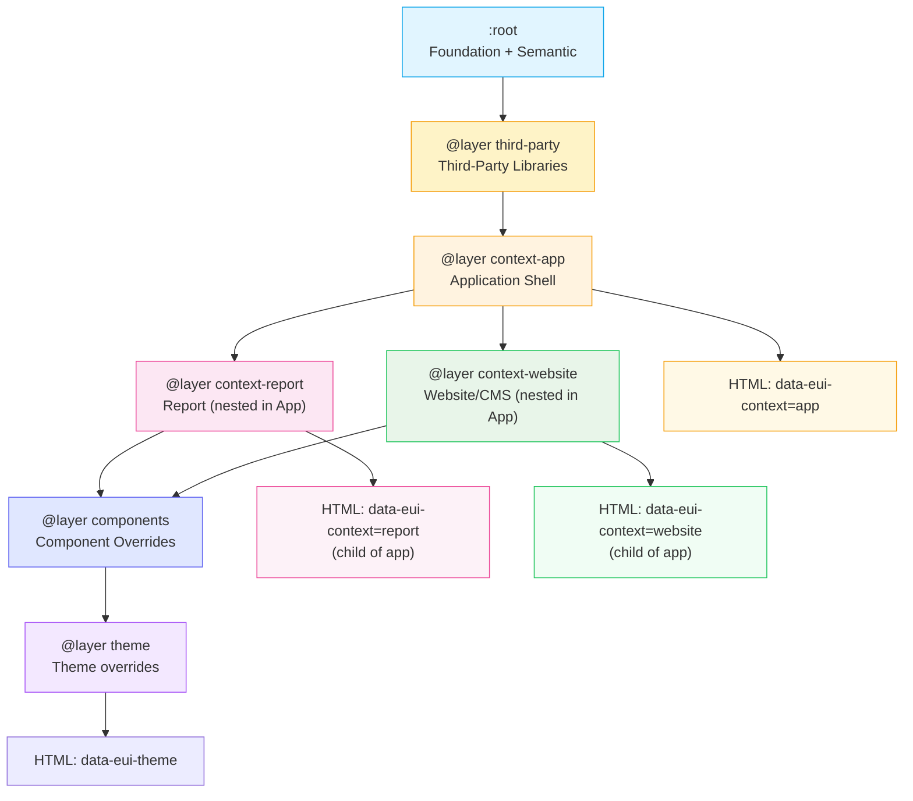
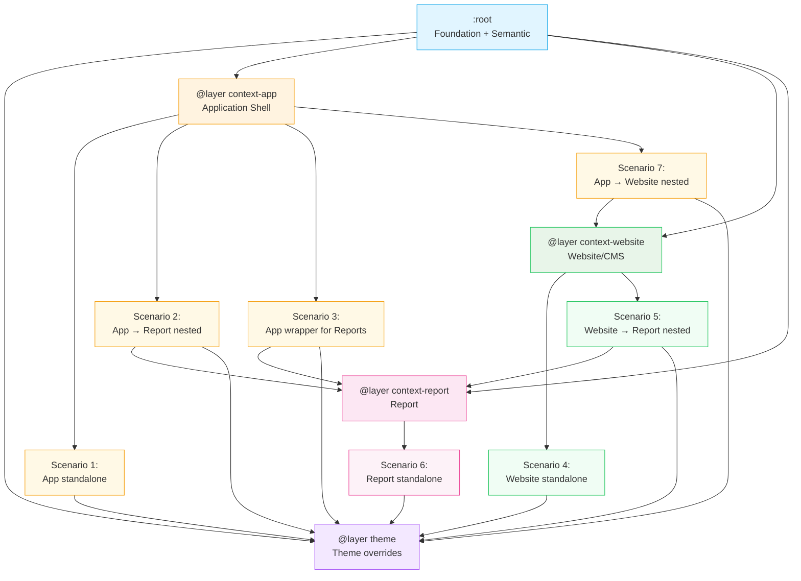
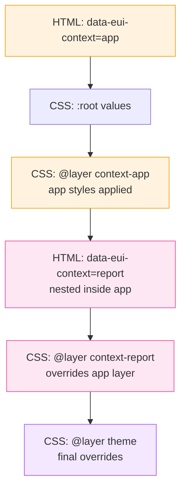
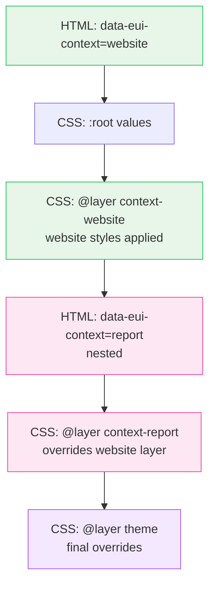
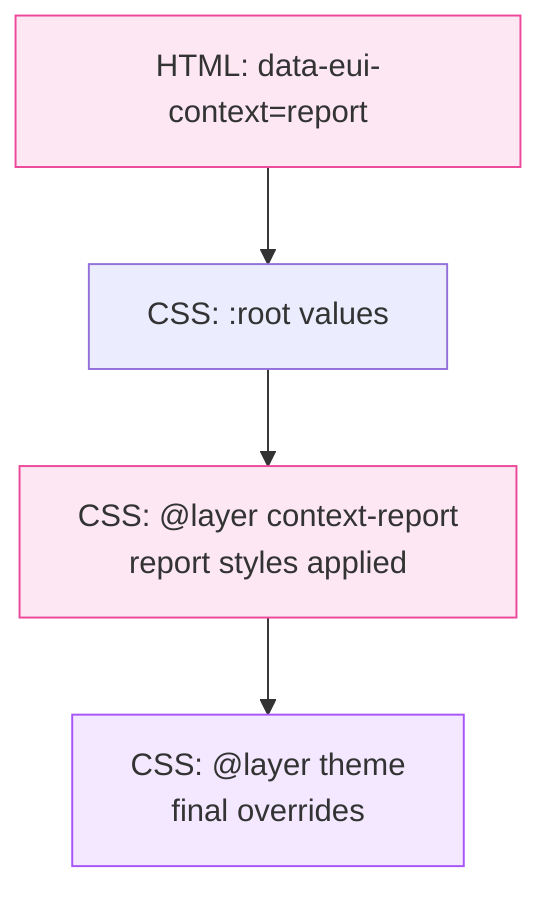

# ADR-0024: CSS Layer Strategy for Context Priority

**Status:** Accepted  
**Date:** 2025-12-26  
**Owner:** Eugene Goncharov  
**Assistance:** AI-assisted drafting (human-reviewed)  
**Related:**  
- [ADR-0023](./ADR-0023-token-organization-context-and-theme-separation.md) — Token Organization - Context and Theme Separation  
- [ADR-0017](./ADR-0017-layered-token-architecture-contexts-and-themes.md) — Layered Token Architecture for Contexts and Themes  
- [ADR-0021](./ADR-0021-web-components-framework-agnostic-layer.md) — Web Components Framework-Agnostic Layer
- [ADR-0030](./ADR-0030-third-party-library-integration-strategy.md) — Third-Party Library Integration Strategy

---

## Context

The token system supports nested contexts (e.g., a `website` preview embedded within an `app` context). CSS selectors with equal specificity can lead to unpredictable overrides when contexts are nested. The previous approach relied solely on CSS selector specificity, which doesn't provide explicit control over cascade order.

Additionally, the system needs to support:
- **Nested contexts**: Inner contexts should override outer contexts
- **Theme priority**: Themes should always have the highest priority
- **Shadow DOM compatibility**: Custom Properties must penetrate Shadow DOM boundaries
- **Predictable cascade**: Explicit control over which styles win in conflicts

The goal is to use CSS `@layer` to establish explicit cascade order while maintaining compatibility with Web Components and Shadow DOM.

---

## Decision

I decided to use CSS `@layer` to define explicit cascade order for contexts and themes, ensuring predictable resolution even with nested contexts.

### Layer Order (Lowest to Highest Priority)

**Example: Application with nested Report and Website/CMS (default/priority scenario)**

This diagram shows the typical scenario where both Report and Website/CMS can be nested inside Application:



**Layer priority order:**
1. `:root` - Foundation and semantic tokens (base values)
2. `@layer third-party` - Third-party library CSS (lowest priority, isolated)
3. `@layer context-app` - Application context styles
4. `@layer context-website` - Website/CMS context styles (overrides app when nested)
5. `@layer context-report` - Report context styles (overrides app when nested)
6. `@layer components` - Component styles and third-party overrides (uses tokens)
7. `@layer theme` - Theme overrides (highest priority)

**Note:** This example shows the default/priority scenario where both Report and Website/CMS can be children of Application (preview and generative scenarios). Other configurations (Website standalone, Report standalone, Website → Report) are also supported, but App → Report and App → Website are the most common patterns.

### Complete CSS Layer Structure

All context layers are generated, but the example above shows the default/priority scenario:

1. **`:root`** - Foundation and semantic tokens (base values)
2. **`@layer third-party`** - Third-party library CSS (lowest priority, isolated)
3. **`@layer context-app`** - Application context overrides
4. **`@layer context-website`** - Website context overrides (available but not shown in default example)
5. **`@layer context-report`** - Report context overrides (overrides app when nested)
6. **`@layer components`** - Component styles and third-party overrides (uses tokens)
7. **`@layer theme`** - Theme overrides (highest priority)

**Note:** See [ADR-0030](./ADR-0030-third-party-library-integration-strategy.md) for third-party library integration strategy.

### Possible Context Configurations

The system supports multiple context nesting scenarios. CSS `@layer` ensures correct resolution regardless of nesting:



### Context Nesting Rules

**Allowed configurations:**
- ✅ **Scenario 1: App standalone**: Application can exist independently
- ✅ **Scenario 2: App → Report**: Report can be nested inside Application
- ✅ **Scenario 3: App wrapper**: Application can wrap multiple Reports
- ✅ **Scenario 4: Website standalone**: Website can exist independently
- ✅ **Scenario 5: Website → Report**: Report can be nested inside Website
- ✅ **Scenario 6: Report standalone**: Report can exist independently
- ✅ **Scenario 7: App → Website**: Website/CMS can be nested inside Application (preview/generative)

**Not allowed:**
- ❌ **Report → App**: Application Shell cannot exist inside Report
- ❌ **Website → App**: Application Shell cannot exist inside Website
- ❌ **Report → Website**: Website cannot exist inside Report

### Nested Context Resolution Examples

**Example 1: App with nested Report**



**Example 2: Website with nested Report**



**Example 3: Standalone Report**



### Generated CSS Structure

```css
/* :root - Foundation and Semantic tokens */
:root {
  --eui-color-brand-500: oklch(45% 0.15 250);
  --eui-color-text-primary: oklch(20% 0 0);
  /* ... */
}

/* Context layers */
@layer context-app {
  [data-eui-context="app"] {
    --eui-typography-base-font-size: 14px;
    /* ... */
  }
}

@layer context-website {
  [data-eui-context="website"] {
    --eui-typography-base-font-size: 16px;
    /* ... */
  }
}

@layer context-report {
  [data-eui-context="report"] {
    --eui-typography-base-font-size: 12px;
    /* ... */
  }
}

/* Theme layer (highest priority) */
@layer theme {
  [data-eui-context="app"][data-eui-theme="accessibility"] {
    --eui-color-text-primary: oklch(10% 0 0);
    /* ... */
  }
  
  [data-eui-context="website"][data-eui-theme="dark"] {
    --eui-color-background-base: oklch(20% 0 0);
    /* ... */
  }
}
```

---

## Rationale

### Explicit Cascade Control

CSS `@layer` provides explicit control over cascade order, independent of selector specificity. This ensures:
- Inner contexts always override outer contexts
- Themes always have the highest priority
- No ambiguity about which styles win

### Nested Context Support

The system supports multiple context nesting scenarios:

**Allowed nesting:**
- App → Report: Reports can be embedded within Application
- Website → Report: Reports can be embedded within Website
- App wrapper: Application can wrap multiple Reports

**Not allowed:**
- Report → App: Application Shell cannot exist inside Report
- Website → App: Application Shell cannot exist inside Website
- Report → Website: Website cannot exist inside Report

**Example: App with nested Report**
```html
<div data-eui-context="app">
  <div data-eui-context="report">
    <!-- This element receives report context styles, overriding app -->
  </div>
</div>
```

The `@layer` order ensures that `context-report` styles override `context-app` styles when nested, and `context-website` styles override `context-app` styles when nested. This works regardless of nesting depth or multiple nested contexts.

### Shadow DOM Compatibility

CSS Custom Properties penetrate Shadow DOM boundaries. The `@layer` directive only affects the cascade order of CSS rules, not Custom Property resolution. This means:
- Web Components receive resolved Custom Property values
- Shadow DOM encapsulation is maintained
- Custom Properties work as expected across boundaries

### Future-Proof

`@layer` is a modern CSS feature (supported in all modern browsers) that provides a foundation for:
- More complex cascade scenarios
- Integration with other CSS features (container queries, etc.)
- Better tooling support

---

## Consequences

### Positive

- **Predictable Cascade**: Explicit layer order eliminates ambiguity
- **Nested Context Support**: Inner contexts naturally override outer contexts
- **Shadow DOM Compatible**: Works seamlessly with Web Components
- **Maintainable**: Clear structure for adding new contexts or themes

### Trade-offs

- **Browser Support**: Requires modern browsers (all current browsers support `@layer`)
- **Build Complexity**: Style Dictionary formats need to generate `@layer` declarations
- **Implementation**: System uses CSS `@layer` to manage cascade priority (handled automatically by build process)

### Implementation Requirements

1. Update Style Dictionary CSS format to generate `@layer` declarations
2. Define layer order in build configuration (including `@layer third-party` and `@layer components`)
3. Generate context selectors within appropriate layers
4. Generate component overrides in `@layer components` (uses tokens)
5. Generate theme selectors in the highest priority layer
6. Ensure `:root` contains base tokens (foundation + semantic)
7. Place all third-party CSS in `@layer third-party` (lowest priority)

---

## Explicit Rules

1. **Layer Order**: Foundation/Semantic → Third-Party → Context-App → Context-Website → Context-Report → Components → Theme
2. **Base Tokens**: Always in `:root` (no layer)
3. **Third-Party CSS**: All third-party library CSS in `@layer third-party` (lowest priority)
4. **Context Tokens**: Each context in its own `@layer`
5. **Component Overrides**: Our component styles and third-party overrides in `@layer components` (uses tokens)
6. **Theme Tokens**: All themes in the highest priority `@layer theme`
5. **Selector Specificity**: `@layer` order overrides selector specificity

---

## Examples

### Nested Context Example

**HTML**:
```html
<div data-eui-context="app">
  <button>App Button</button>
  
  <div data-eui-context="website">
    <button>Website Button</button>
  </div>
</div>
```

**CSS Resolution**:
1. `:root` provides base values
2. `@layer context-app` applies to both buttons
3. `@layer context-website` overrides for the inner button
4. `@layer theme` applies final overrides (if theme is set)

### How @layer Handles All Configurations

The `@layer` order ensures predictable resolution for all possible context configurations:

**Layer Priority (from lowest to highest):**
1. `:root` - Base tokens (foundation + semantic)
2. `@layer context-app` - App context styles
3. `@layer context-website` - Website context styles
4. `@layer context-report` - Report context styles
5. `@layer theme` - Theme overrides (highest priority)

**Why this works for all scenarios:**

- **Standalone contexts**: Each context layer applies independently when no nesting exists
- **Nested contexts**: Inner context layers override outer context layers due to `@layer` order
- **Multiple reports in app**: Each report element receives report layer styles, overriding app layer
- **Theme priority**: Theme layer always has highest priority, regardless of context nesting

**Example: App wrapper with multiple Reports**

```html
<div data-eui-context="app" data-eui-theme="default">
  <div>App content</div>
  <div data-eui-context="report" data-eui-theme="print">
    Report 1
  </div>
  <div data-eui-context="report" data-eui-theme="screen">
    Report 2
  </div>
</div>
```

**CSS Resolution:**
1. App content: `:root` → `@layer context-app` → `@layer theme`
2. Report 1: `:root` → `@layer context-app` → `@layer context-report` → `@layer theme`
3. Report 2: `:root` → `@layer context-app` → `@layer context-report` → `@layer theme`

The `@layer context-report` overrides `@layer context-app` for report elements, ensuring correct styling regardless of nesting depth.

### Web Component Example

**Web Component** (Shadow DOM):
```html
<eui-button>Click me</eui-button>
```

**CSS Custom Properties penetrate Shadow DOM**:
```css
/* In component's Shadow DOM */
button {
  background: var(--eui-color-brand-primary);
  /* This receives the resolved value from the host context */
}
```

The `@layer` order ensures the correct value is resolved, and Custom Properties carry that value into the Shadow DOM.

---

## Notes

This ADR focuses on CSS generation. For Figma Variables integration, see:
- [ADR-0025](./ADR-0025-figma-variables-integration-strategy.md) — Figma Variables Integration Strategy

For token organization, see:
- [ADR-0023](./ADR-0023-token-organization-context-and-theme-separation.md) — Token Organization - Context and Theme Separation

