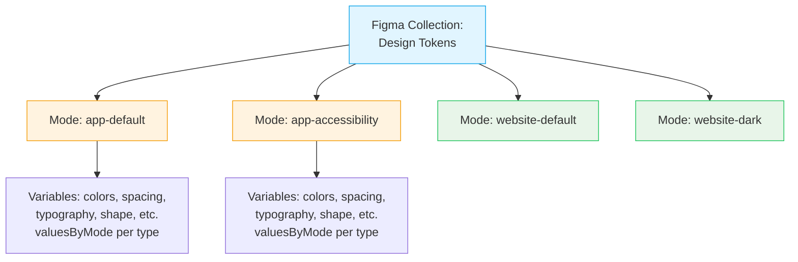
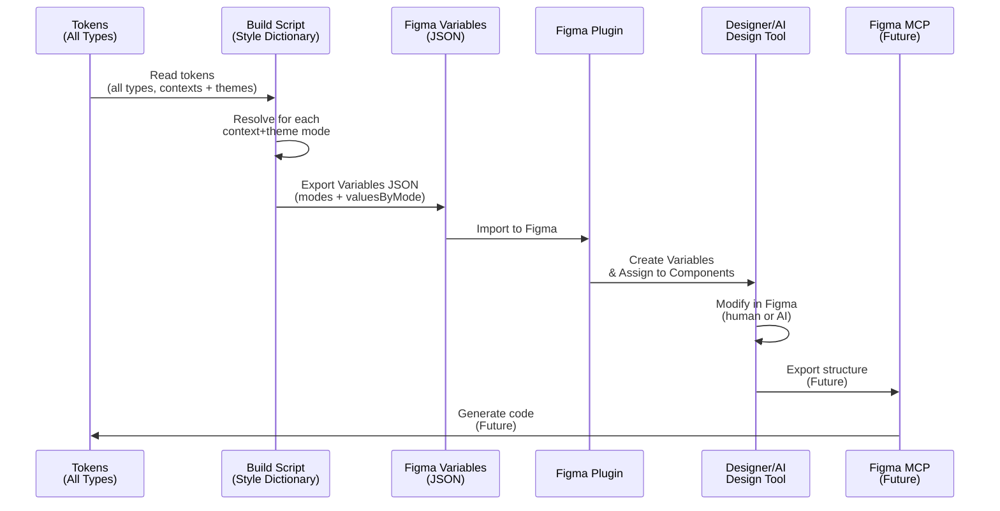
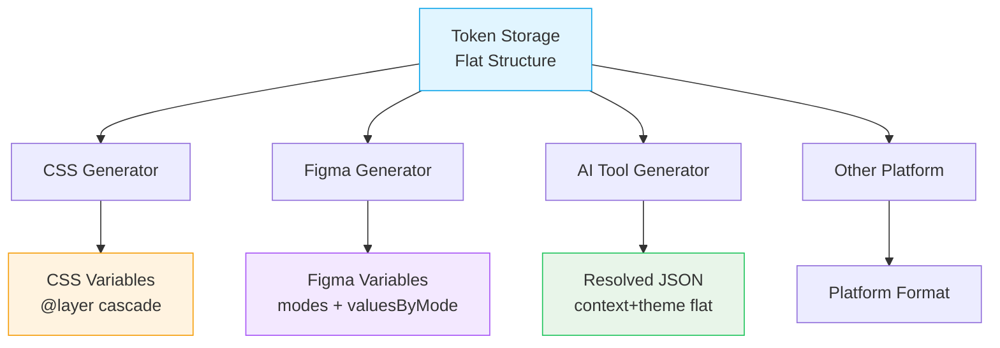

# ADR-0025: Figma Variables Integration Strategy

**Status:** Accepted  
**Date:** 2025-12-26  
**Owner:** Eugene Goncharov  
**Assistance:** AI-assisted drafting (human-reviewed)  
**Related:**  
- [ADR-0027](./ADR-0027-figma-files-structure-and-organization.md) — Figma Files Structure and Organization  
- [ADR-0023](./ADR-0023-token-organization-context-and-theme-separation.md) — Token Organization - Context and Theme Separation  
- [ADR-0024](./ADR-0024-css-layer-strategy-context-priority.md) — CSS Layer Strategy for Context Priority  
- [ADR-0014](./ADR-0014-color-model-tonal-scales-and-contextual-architecture.md) — Color Model, Tonal Scales, and Contextual Architecture  
- [ADR-0003](./ADR-0003-data-driven-figma-variables-pipeline.md) — Data-Driven Figma Variables Pipeline via Adapter JSON

---

## Context

The design system supports multiple contexts (app, website, report) with multiple themes (default, dark, accessibility) per context. The token system includes various types: colors, spacing, typography, shape (border radius, line thickness), layout parameters, and other aesthetic properties. Figma Variables uses "modes" to represent different values for the same variable across all token types.

**Note:** Throughout this ADR, "designer" refers to both human designers and AI-assisted design tools (generative design tools, AI helpers). The system is designed to work equally well for human designers and AI design tools, as the organization has primarily developers with limited dedicated design resources.

The previous Figma export only supported a single `mode: "default"`, losing all context and theme information. This made it impossible to:
- Switch between contexts/themes in Figma
- Preview different visual variants
- Export context+theme-specific designs
- Maintain bidirectional sync between code and Figma

The system needs:
- **Bidirectional Pipeline**: Import tokens to Figma, export from Figma (future)
- **Mode Structure**: Map context+theme combinations to Figma modes
- **Predictability**: Designers (human or AI-assisted design tools) should be able to switch modes and see expected results

---

## Decision

I decided to implement a bidirectional Figma Variables pipeline with the following structure:

### Figma Variables Structure

**Modes** represent context+theme combinations:
- `app-default`
- `app-accessibility`
- `website-default`
- `website-dark`
- `report-print`
- `report-screen`

**Variables** use `valuesByMode` to store different values for each mode:

```json
{
  "name": "text.primary",
  "type": "COLOR",
  "modes": ["app-default", "app-accessibility", "website-default", "website-dark"],
  "valuesByMode": {
    "app-default": "#000000",
    "app-accessibility": "#000000",
    "website-default": "#1a1a1a",
    "website-dark": "#ffffff"
  }
}
```

### Figma Variables Structure Diagram



### Bidirectional Pipeline Flow



### Platform-Specific Resolution



---

## Rationale

### Mode-Based Structure

Figma Variables use "modes" to represent different values for the same variable. Mapping context+theme combinations to modes:
- Allows designers (human or AI-assisted design tools) to switch between variants in Figma
- Maintains the relationship between contexts and themes
- Enables preview of different visual states
- Supports future bidirectional sync

### Bidirectional Pipeline

A bidirectional pipeline enables:
- **Import**: Tokens → Figma Variables (current)
- **Export**: Figma Variables → Tokens (future, via Figma MCP)
- **Sync**: Keep code and Figma in sync
- **Workflow**: Designers (human or AI-assisted design tools) can modify in Figma, developers can pull changes

### Predictability for Designers and AI Design Tools

The mode structure ensures:
- Designers (human or AI-assisted design tools) can switch modes and see expected results
- Each mode represents a specific context+theme combination
- Variable names are consistent across modes
- Future tools (Figma MCP, generative design AI) can understand the structure
- AI design tools can use the same structure as human designers

---

## Consequences

### Positive

- **Designer/AI Tool Experience**: Easy switching between contexts/themes in Figma for both human designers and AI-assisted design tools
- **Bidirectional Sync**: Foundation for future export from Figma
- **Predictable Structure**: Clear mapping between tokens and Figma modes
- **Comprehensive Token Support**: All token types (colors, spacing, typography, shape, etc.) are supported

### Trade-offs

- **Plugin Updates**: Figma plugin needs to support `modes` and `valuesByMode`
- **Complexity**: More complex export logic than single-mode approach

### Implementation Requirements

1. **Style Dictionary Format**: Generate Figma Variables with `modes` and `valuesByMode`
2. **Mode Generation**: Create modes for each context+theme combination
3. **Figma Plugin Updates**: Update plugin to support new structure
4. **Token Type Support**: Handle all token types (colors, spacing, typography, shape, etc.)

---

## Explicit Rules

1. **Mode Naming**: Format is `{context}-{theme}` (e.g., `app-default`, `website-dark`)
2. **Variable Structure**: Each variable must have `modes` array and `valuesByMode` object
3. **Collection Organization**: Variables grouped by semantic category (colors, spacing, typography, shape, etc.)
4. **Token Types**: All token types are exported (colors, spacing, typography, shape, layout parameters, etc.)

---

## Examples

### Token Resolution for Mode

**Input** (tokens):
```json
{
  "foundations": { "color": { "brand": { "500": "oklch(45% 0.15 250)" } } },
  "semantic": { "color": { "text": { "primary": "{brand.500}" } } },
  "contexts": { "app": { "color": { "text": { "primary": "{brand.700}" } } } },
  "themes": { "app": { "default": {} } }
}
```

**Output** (Figma Variable for `app-default` mode):
```json
{
  "name": "text.primary",
  "type": "COLOR",
  "modes": ["app-default"],
  "valuesByMode": {
    "app-default": "rgb(30, 64, 175)" // Converted from OKLCH
  }
}
```

### Figma Plugin Compatibility

**Current Plugin** (needs updates):
- Only supports `mode: "default"`
- Only supports single `value` per variable
- Uses `hexToPaint` for color conversion

**Required Updates**:
- Support `modes: string[]` array
- Support `valuesByMode: { [mode: string]: string }` object
- Convert RGB strings to Figma `Paint` objects
- Create/update multiple modes in Figma

---

## Implementation Details

### Style Dictionary Format

The `figmaVariablesScoped.js` format:
1. Reads all context+theme combinations
2. Resolves tokens for each combination (all types: colors, spacing, typography, shape, etc.)
3. Generates Figma Variables JSON with `modes` and `valuesByMode` for all token types

### Mode Generation

```javascript
const contexts = ['app', 'website', 'report'];
const themes = {
  app: ['default', 'accessibility'],
  website: ['default', 'dark'],
  report: ['print', 'screen']
};

const modes = [];
contexts.forEach(context => {
  themes[context].forEach(theme => {
    modes.push(`${context}-${theme}`);
  });
});
```

---

## Color Format Conversion

**Note:** This section addresses a technical detail specific to color tokens. For the full color model strategy, see [ADR-0014](./ADR-0014-color-model-tonal-scales-and-contextual-architecture.md).

The design system uses OKLCH color format for perceptual uniformity (see [ADR-0014](./ADR-0014-color-model-tonal-scales-and-contextual-architecture.md)). Figma Variables currently requires RGB/RGBA format for colors. During export, color tokens are converted from OKLCH to RGB using the `culori` library. If conversion fails, the system falls back to the original HEX value (if available).

This conversion is handled automatically during the build process and does not affect other token types (spacing, typography, shape, etc.), which are exported directly without conversion.

---

## Future Considerations

### Figma MCP Integration

Figma MCP (Model Context Protocol) will enable:
- **Export**: Read Figma Variables and generate code
- **Bidirectional Sync**: Keep code and Figma in sync
- **AI Integration**: Use Figma structure for code generation

### Nested Contexts in Figma

Figma doesn't support nested contexts directly. The solution:
- Create explicit combined modes (e.g., `app-website-default`)
- Designers (human or AI-assisted design tools) manually switch to the appropriate mode
- Future: Use Figma MCP to handle nested context resolution

### Variable Organization

Consider organizing variables by:
- **Collections**: Colors, Spacing, Typography, etc.
- **Scopes**: Component-specific variables
- **Modes**: Context+theme combinations

---

## Color Format Conversion

**Note:** This section addresses a technical detail specific to color tokens. For the full color model strategy, see [ADR-0014](./ADR-0014-color-model-tonal-scales-and-contextual-architecture.md).

The design system uses OKLCH color format for perceptual uniformity (see [ADR-0014](./ADR-0014-color-model-tonal-scales-and-contextual-architecture.md)). Figma Variables currently requires RGB/RGBA format for colors. During export, color tokens are converted from OKLCH to RGB using the `culori` library. If conversion fails, the system falls back to the original HEX value (if available).

This conversion is handled automatically during the build process and does not affect other token types (spacing, typography, shape, etc.), which are exported directly without conversion.

---

## Notes

This ADR focuses on the Figma Variables structure and export strategy. For file structure and organization, see:
- [ADR-0027](./ADR-0027-figma-files-structure-and-organization.md) — Figma Files Structure and Organization

For CSS generation, see:
- [ADR-0024](./ADR-0024-css-layer-strategy-context-priority.md) — CSS Layer Strategy for Context Priority

For token organization, see:
- [ADR-0023](./ADR-0023-token-organization-context-and-theme-separation.md) — Token Organization - Context and Theme Separation

For the Figma plugin implementation details, see the plugin code in `figma-plugin/` directory.

