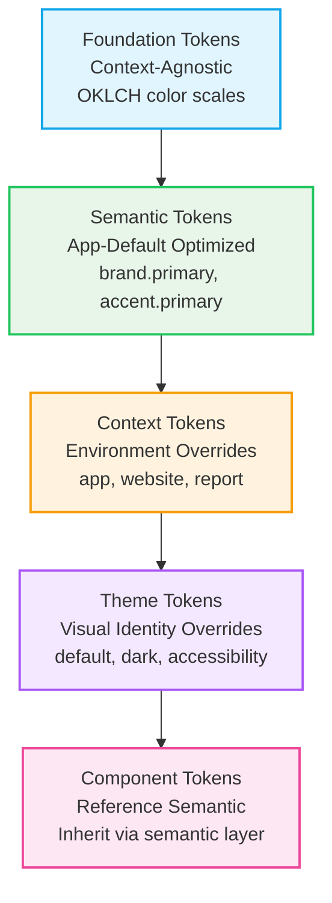

# ADR-0026: App-Default Color Positioning and Semantic Token Optimization

**Status:** Accepted  
**Date:** 2025-12-29  
**Owner:** Eugene Goncharov  
**Assistance:** AI-assisted drafting (human-reviewed)  
**Related:**  
- [ADR-0017](./ADR-0017-layered-token-architecture-contexts-and-themes.md) — Layered Token Architecture for Contexts and Themes  
- [ADR-0014](./ADR-0014-color-model-tonal-scales-and-contextual-architecture.md) — Color Model, Tonal Scales, and Contextual Architecture  
- [ADR-0023](./ADR-0023-token-organization-context-and-theme-separation.md) — Token Organization - Context and Theme Separation
- [ADR-0025](./ADR-0025-figma-variables-integration-strategy.md) — Figma Variables Integration Strategy

---

## Context

After implementing the layered token architecture (Foundation → Semantic → Context → Theme → Component) and completing the color scale re-architecture (Brand-700 anchor, Accent-600 anchor, neutral scale rebalancing), we needed to clarify the positioning of color tokens within the system.

The system serves multiple contexts (application shell, website/CMS, reports) with different visual requirements. However, the **application shell is the primary destination** and represents the most common use case. This raised the question: **Where should the default color values live, and how should they be positioned?**

Key questions to answer:
1. Should foundations be context-specific or context-agnostic?
2. Should semantic tokens have context-neutral defaults or be optimized for a specific context?
3. How should this be reflected in Figma export (which mode is default)?
4. How should this be reflected in Storybook (which context/theme is shown by default)?

## Decision

I decided to **optimize semantic tokens for `app-default` context/theme** while keeping foundations context-agnostic:

### Foundation Layer (Context-Agnostic)
- **Foundations** (`tokens/foundations/colors/`) remain **context-agnostic**
- Base color scales (neutral, brand, accent) are shared across all contexts
- These represent raw color values, not semantic meanings
- Examples:
  - `eui.color.brand.700` = `oklch(49% 0.10 230)` (canonical brand anchor)
  - `eui.color.accent.600` = `oklch(70% 0.13 225)` (canonical accent anchor, Viking Blue)
  - `eui.color.neutral.50` through `900` (neutral scale)

### Semantic Layer (App-Default Optimized)
- **Semantic tokens** (`tokens/semantic/colors/`) are **optimized for `app-default`** by default
- These tokens reference foundations and define semantic meanings
- Values are chosen to work best for application shell UI in default theme
- Other contexts/themes can override these values as needed
- Examples:
  - `eui.color.brand.primary` → `{eui.color.brand.700}` (optimized for app-default)
  - `eui.color.accent.primary` → `{eui.color.accent.600}` (optimized for app-default)
  - `eui.color.background.surface` → `{eui.color.neutral.white}` (optimized for app-default)

### Context and Theme Layers (Overrides)
- **Context tokens** (within `tokens/{context}/`) can override semantic tokens for specific environments
- **Theme tokens** (within `tokens/{context}/themes/`) can override semantic tokens within a context
- Only override what differs from app-default
- Examples:
  - `tokens/website/semantic/colors/text.json` might override `eui.color.text.primary` for website context
  - `tokens/app/themes/accessibility.json` might override colors for high contrast

**Note (2025-12-31):** The token structure has been reorganized. Each context now has its own complete structure. Context-specific overrides are within `tokens/{context}/semantic/` and theme overrides are in `tokens/{context}/themes/`. See [ADR-0023](./ADR-0023-token-organization-context-and-theme-separation.md) for details.

### Default Positioning



## Rationale

### Why Keep Foundations Context-Agnostic?

1. **Reusability**: Base color scales can be shared across all contexts without duplication
2. **Maintainability**: Changes to foundations propagate to all contexts automatically
3. **Flexibility**: Different contexts can map foundations to semantic tokens differently
4. **Clarity**: Foundations represent "what colors exist," not "how they're used"

### Why Optimize Semantic Tokens for App-Default?

1. **Primary Destination**: Application shell is the primary use case (80%+ of usage)
2. **Sensible Defaults**: App-default values work well for most scenarios
3. **Inheritance Model**: Other contexts/themes can inherit or override as needed
4. **Developer Experience**: Developers working on applications get sensible defaults without configuration
5. **Figma Alignment**: Figma export uses `app-default` as mode 0 (default mode)
6. **Storybook Alignment**: Storybook displays `app-default` by default

### Why Not Make Foundations App-Specific?

1. **Duplication Risk**: Would require duplicating foundations for each context
2. **Maintenance Burden**: Changes to color scales would need to be replicated
3. **Loss of Flexibility**: Other contexts couldn't reuse the same color scales
4. **Architectural Clarity**: Foundations should represent "what exists," not "how it's used"

### Color Scale Re-Architecture Decisions

The color scale re-architecture decisions align with app-default optimization:

1. **Brand-700 as Anchor**: Brand-700 is perceptually dark, suitable for primary actions in application UI
2. **Accent-600 as Anchor**: Accent-600 (Viking Blue) is lighter, suitable for interactive elements and selected states
3. **Neutral Scale Rebalancing**: More light shades (50-300) for UI surfaces, fewer dark shades (800-900) for text

These decisions were made with application UI in mind, reinforcing the app-default optimization strategy.

## Consequences

### Benefits

- **Clear Positioning**: Developers understand that semantic tokens are optimized for app-default
- **Sensible Defaults**: Application developers get working colors without configuration
- **Flexibility**: Other contexts/themes can override as needed
- **Figma Alignment**: Figma export uses app-default as the default mode (mode 0)
- **Storybook Alignment**: Storybook displays app-default by default
- **Maintainability**: Foundations remain context-agnostic, reducing duplication

### Trade-offs

- **Potential Confusion**: Developers might assume semantic tokens are context-neutral
- **Documentation Required**: Need to document that semantic tokens are app-default optimized
- **Override Complexity**: Other contexts/themes need to explicitly override semantic tokens

### Implementation Details

**Token Files:**
- Semantic tokens include `$description` fields explaining app-default optimization
- Descriptions reference that other contexts/themes may override values

**Figma Export:**
- `app-default` is exported as mode 0 (default mode)
- Other context+theme combinations are exported as additional modes
- Variables use `valuesByMode` structure

**Storybook:**
- Default context: `app`
- Default theme: `default`
- Toolbar allows switching between contexts/themes
- Color scale stories display context/theme information

**CSS Generation:**
- Base tokens (foundations, semantic) output to `:root`
- Context tokens output to `[data-eui-context="app"]`, etc.
- Theme tokens output to `[data-eui-context="app"][data-eui-theme="default"]`, etc.

## Explicit Rules

1. **Foundations are context-agnostic** - Base color scales are shared across all contexts
2. **Semantic tokens are app-default optimized** - Values are chosen for application shell UI
3. **Other contexts/themes can override** - Only override what differs from app-default
4. **Figma export uses app-default as mode 0** - Default mode represents app-default
5. **Storybook displays app-default by default** - Default context/theme is app/default

## Examples

### Foundation Token (Context-Agnostic)
```json
{
  "eui": {
    "color": {
      "brand": {
        "700": {
          "$value": "oklch(49% 0.10 230)",
          "$type": "color",
          "$description": "Base brand color - canonical brand color (anchor) - derived from RGB(6, 106, 141)"
        }
      }
    }
  }
}
```

### Semantic Token (App-Default Optimized)
```json
{
  "eui": {
    "color": {
      "brand": {
        "primary": {
          "$value": "{eui.color.brand.700}",
          "$type": "color",
          "$description": "Primary brand color. Optimized for app-default context/theme. Uses Brand-700 as the canonical anchor color. Other contexts/themes may override this value."
        }
      }
    }
  }
}
```

### Theme Override (App-Accessibility)
```json
{
  "eui": {
    "color": {
      "text": {
        "primary": {
          "$value": "{eui.color.neutral.900}",
          "$type": "color",
          "$description": "Maximum contrast text for accessibility theme. Overrides app-default semantic value."
        }
      }
    }
  }
}
```

## Notes

This ADR documents the positioning strategy. Implementation details for CSS generation, Figma export, and Storybook integration are documented in:
- [ADR-0024](./ADR-0024-css-layer-strategy-context-priority.md) — CSS Layer Strategy for Context Priority
- [ADR-0025](./ADR-0025-figma-variables-integration-strategy.md) — Figma Variables Integration Strategy
- [ADR-0022](./ADR-0022-storybook-model-ai-agent-oriented-architecture.md) — Storybook Model: AI Agent-Oriented Architecture

The color scale re-architecture (Brand-700, Accent-600 anchors) is documented separately but aligns with this positioning strategy.

