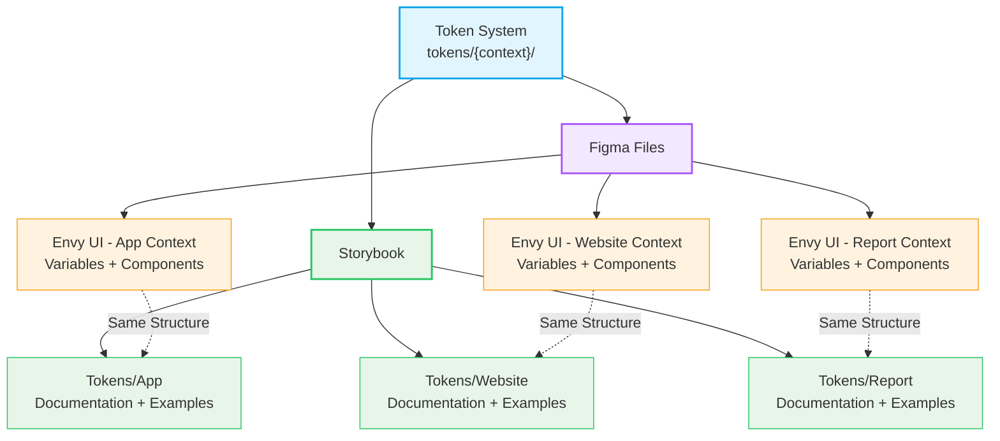

# ADR-0027: Figma Files Structure and Organization

**Status:** Accepted
**Date:** 2025-12-31
**Last Updated:** 2025-12-31
**Owner:** Eugene Goncharov
**Assistance:** AI-assisted drafting (human-reviewed)
**Related:**
- [ADR-0025](./ADR-0025-figma-variables-integration-strategy.md) — Figma Variables Integration Strategy
- [ADR-0023](./ADR-0023-token-organization-context-and-theme-separation.md) — Token Organization - Context and Theme Separation
- [ADR-0022](./ADR-0022-storybook-model-ai-agent-oriented-architecture.md) — Storybook Model as AI-Agent-Oriented Architecture Layer
- [ADR-0003](./ADR-0003-data-driven-figma-variables-pipeline.md) — Data-Driven Figma Variables Pipeline via Adapter JSON

---

## Context

The design system supports three independent contexts (app, website, report), each with its own complete token structure. Each context has multiple themes (app: default, accessibility; website: default, dark; report: print, screen). The token system is fully separated by context to ensure complete independence and avoid cross-context dependencies.

The system needs a clear Figma file structure that:
- Reflects the context separation in the token system
- Supports Figma Code Connect for linking components to code
- Provides clear organization for designers (human and AI-assisted design tools)
- Enables efficient workflow for context-specific design work
- Maintains consistency with the token architecture
- Aligns with Storybook organization (which also uses context-based structure)

Previous considerations included:
- Single file with all contexts (too complex, risk of confusion)
- Hybrid approach with core components + context files (unclear ownership, Code Connect complexity)
- Three independent files (matches token structure, clear separation)

---

## Decision

I decided to organize Figma files as **three independent, context-specific files**, each containing a complete design system for that context.

### File Structure

```
📁 Envy UI - App Context
📁 Envy UI - Website Context
📁 Envy UI - Report Context
```

Each file is completely independent and contains:
- **Variables**: All design tokens for that context (with modes for themes)
- **Components**: All components using context-specific tokens
- **Patterns**: Component compositions and design patterns
- **Documentation**: Context-specific guidelines and references

### File Organization

Each Figma file contains the following pages:

#### 1. Variables Page

Contains all design tokens organized into **Collections** (automatically generated from token structure):

**Collection Organization:**

Collections are automatically organized by category and group:

- **Colors Collections** (`envy-ui • Colors / {GroupName}`):
  - `envy-ui • Colors / Brand` - Brand color scale (50-900)
  - `envy-ui • Colors / Neutral` - Neutral color scale
  - `envy-ui • Colors / Accent` - Accent color scale
  - `envy-ui • Colors / Status` - Status colors (success, error, warning, info)
  - `envy-ui • Colors / Text` - Semantic text colors
  - `envy-ui • Colors / Background` - Semantic background colors
  - `envy-ui • Colors / Border` - Semantic border colors
  - `envy-ui • Colors / {ComponentName}` - Component-specific colors

- **Size Collections** (`envy-ui • Size / {Category}`):
  - `envy-ui • Size / Spacing` - Spacing scale (base, sm, md, lg, etc.)
  - `envy-ui • Size / Layout` - Layout dimensions (container, page, section)
  - `envy-ui • Size / {ComponentName}` - Component-specific sizes

- **Shape Collections** (`envy-ui • Shape / {Category}`):
  - `envy-ui • Shape / Radius` - Border radius values
  - `envy-ui • Shape / {ComponentName}` - Component-specific shapes

- **Border Collections** (`envy-ui • Border / {Category}`):
  - `envy-ui • Border / Border` - Border width values
  - `envy-ui • Border / {ComponentName}` - Component-specific borders

- **Focus Collections** (`envy-ui • Focus / {Category}`):
  - `envy-ui • Focus / Focus` - Focus ring properties
  - `envy-ui • Focus / {ComponentName}` - Component-specific focus

- **Dimensions Collections** (`envy-ui • Dimensions / {Category}`):
  - `envy-ui • Dimensions / Typography` - Typography values
  - Other numeric values that don't fit other categories

**Modes in Collections:**

Each collection contains modes representing context+theme combinations:
- **App Context**: `app-default`, `app-accessibility`
- **Website Context**: `website-default`, `website-dark`
- **Report Context**: `report-print`, `report-screen`

Each variable has `valuesByMode` with values for each applicable mode.

**Collection Naming Rules:**

- Format: `{systemId} • {Category} / {GroupName}`
- System ID: `envy-ui`
- Categories: Colors, Size, Shape, Border, Focus, Dimensions
- Group names derived from token paths (e.g., `brand`, `neutral`, `spacing`, `button`)

#### 2. Components Page

Contains all design components organized by category:

```
Components/
├── Foundation/
│   ├── Colors (swatches with Variables)
│   ├── Typography (text styles)
│   └── Spacing (spacing scale visualization)
├── Primitives/
│   ├── Button/
│   │   ├── Variants (Primary, Secondary, Accent, etc.)
│   │   ├── States (Default, Hover, Disabled, Focus, etc.)
│   │   └── Sizes (S, M, L)
│   ├── Input/
│   ├── Select/
│   ├── Checkbox/
│   ├── Switch/
│   └── ...
├── Composites/
│   ├── Form Field/
│   ├── Alert Banner/
│   ├── Card/
│   └── ...
└── Layout/
    ├── Card/
    ├── Modal/
    ├── App Shell/
    └── ...
```

**Component Naming:**
- Components use simple names without context prefix: `Button`, `Input`, `Select`
- Context is implicit (component is in context-specific file)
- Components use Variables from the same file's Variables page
- Variants use Figma Variants feature (Primary/Secondary, S/M/L, etc.)

**Component Organization:**
- **Foundation**: Visual foundation elements (colors, typography, spacing)
- **Primitives**: Basic UI components (button, input, select)
- **Composites**: Composed components (form field, alert banner)
- **Layout**: Layout components (card, modal, app shell)

#### 3. Patterns Page

Contains component compositions and design patterns:

```
Patterns/
├── Forms/
│   ├── Login Form
│   ├── Registration Form
│   └── Settings Form
├── Navigation/
│   ├── Sidebar Navigation
│   ├── Top Navigation
│   └── Breadcrumbs
├── Data Display/
│   ├── Table
│   ├── List
│   └── Card Grid
└── ...
```

Patterns demonstrate how components work together in real-world scenarios.

#### 4. Documentation Page

Contains context-specific documentation:

```
Documentation/
├── Token Reference
│   ├── Color Tokens
│   ├── Spacing Tokens
│   └── Typography Tokens
├── Usage Guidelines
│   ├── Component Usage
│   ├── Pattern Guidelines
│   └── Best Practices
└── Code Connect Links
    └── Links to code components
```

### Storybook Alignment

Storybook uses the same context-based organization, creating a consistent structure across design and documentation:

**Storybook Structure:**
```
Storybook Navigation
├── Tokens/
│   ├── App/
│   │   ├── Context overview
│   │   ├── Foundations/
│   │   ├── Semantic/
│   │   ├── Components/
│   │   └── Themes/
│   ├── Website/
│   │   └── ... (same structure)
│   └── Report/
│       └── ... (same structure)
└── ...
```

**Figma-Storybook Relationship:**



**Alignment Benefits:**
- **Consistent Mental Model**: Same structure in Figma and Storybook
- **Easy Navigation**: Developers and designers use the same organization
- **Documentation Sync**: Storybook documentation matches Figma structure
- **Token Visibility**: Storybook shows the same tokens that are in Figma Variables
- **Cross-Reference**: Easy to reference between Figma and Storybook

**Storybook as Documentation Layer:**
- Storybook provides detailed token documentation with README files
- Each context has its own documentation (`tokens/{context}/README.md`)
- Theme documentation explains theme-specific overrides
- Component token stories mirror the token file structure

**Figma as Design Layer:**
- Figma provides visual design tools and Variables
- Components are designed and styled using Variables
- Patterns demonstrate real-world usage
- Code Connect links design to code

Together, Storybook and Figma provide:
- **Storybook**: Technical documentation, token reference, code examples
- **Figma**: Visual design, component library, design patterns
- **Shared Structure**: Both organized by context for consistency

---

## Rationale

### Context Separation

**Matches Token Architecture:**
- Each context has its own complete token structure
- Figma files mirror this separation
- No cross-context dependencies or confusion

**Designer Workflow:**
- Designers work only with the context they need
- No need to filter or ignore irrelevant components
- Clear mental model: one file = one context

**Code Connect Compatibility:**
- Each component can be linked to code with clear context
- URL structure: `{context-file} → {component-node}`
- No ambiguity about which context a component belongs to

### Complete Independence

**Benefits:**
- Each context can evolve independently
- Changes in one context don't affect others
- Clear ownership and responsibility
- Easier to scale (add new contexts without affecting existing ones)

**Trade-offs:**
- Some component duplication across files
- This is acceptable because components use different tokens
- Visual appearance differs even if structure is similar

### Collection Organization

**Automatic Organization:**
- Collections are automatically generated from token paths
- Consistent naming across all contexts
- Easy to find variables by category and group

**Scalability:**
- New tokens automatically go to correct collections
- No manual organization required
- Structure reflects token hierarchy

### Component Naming

**No Context Prefix:**
- Components are named simply: `Button`, `Input`, `Select`
- Context is implicit (file name)
- Matches code component names
- Easier for Code Connect mapping

**Figma Variants:**
- Use Figma's Variants feature for component variations
- Primary/Secondary, S/M/L, Default/Hover/Disabled
- Cleaner than manual component duplication

---

## Consequences

### Positive

- **Clear Separation**: Each context is completely isolated
- **Code Connect Ready**: Clear mapping between Figma and code
- **Designer Experience**: Work only with relevant context
- **Scalability**: Easy to add new contexts
- **Consistency**: Structure matches token architecture
- **Maintainability**: Changes isolated to specific context

### Trade-offs

- **File Count**: Three files instead of one (acceptable for clarity)
- **Component Duplication**: Similar components in multiple files (but using different tokens, so acceptable)
- **Maintenance**: Need to update components in multiple files (but they're context-specific, so this is expected)

### Implementation Requirements

1. **Three Figma Files**: Create separate files for each context
2. **Context Validation**: Plugin validates context match before import
3. **Code Connect Files**: Update Code Connect files to reference correct context file
4. **Documentation**: Document file structure and organization
5. **Naming Conventions**: Establish and document naming conventions

---

## Explicit Rules

1. **File Naming**: Format is `Envy UI - {Context} Context` (e.g., `Envy UI - App Context`)
2. **Context Separation**: Each context has its own complete file
3. **Component Naming**: Components use simple names without context prefix
4. **Variable Collections**: Automatically organized by category and group
5. **Modes**: Each context file contains only modes for that context's themes
6. **Code Connect**: Each component links to code via context-specific file URL
7. **No Cross-Context References**: Components in one file cannot reference Variables from another file

---

## Examples

### File Structure Example

**App Context File:**
```
Envy UI - App Context
├── Variables (page)
│   ├── envy-ui • Colors / Brand
│   │   ├── color.brand.50 (modes: app-default, app-accessibility)
│   │   ├── color.brand.100
│   │   └── ...
│   ├── envy-ui • Colors / Neutral
│   ├── envy-ui • Size / Spacing
│   │   ├── spacing.base (modes: app-default, app-accessibility)
│   │   └── ...
│   ├── envy-ui • Shape / Radius
│   └── ...
├── Components (page)
│   ├── Foundation/
│   │   ├── Colors (swatches with Variables)
│   │   ├── Typography (text styles)
│   │   └── Spacing (spacing scale visualization)
│   ├── Primitives/
│   │   ├── Button/
│   │   │   ├── Variants (Primary, Secondary, Accent)
│   │   │   ├── States (Default, Hover, Disabled, Focus)
│   │   │   └── Sizes (S, M, L)
│   │   ├── Input/
│   │   └── Select/
│   ├── Composites/
│   │   ├── Form Field/
│   │   ├── Alert Banner/
│   │   └── Card/
│   └── Layout/
│       ├── Modal/
│       └── App Shell/
├── Patterns (page)
│   ├── Forms/
│   ├── Navigation/
│   └── Data Display/
└── Documentation (page)
    ├── Token Reference
    ├── Usage Guidelines
    └── Code Connect Links
```

**Website Context File:**
```
Envy UI - Website Context
├── Variables (page)
│   ├── envy-ui • Colors / Brand
│   │   ├── color.brand.50 (modes: website-default, website-dark)
│   │   └── ... (different values than App context)
│   ├── envy-ui • Colors / Neutral
│   │   └── ... (different values than App context)
│   └── ...
├── Components (page)
│   ├── Foundation/
│   ├── Primitives/
│   │   ├── Button/ (same structure, different visual appearance)
│   │   └── ...
│   ├── Composites/
│   └── Layout/
├── Patterns (page)
└── Documentation (page)
```

### Code Connect Example

**Interactive Component in App Context:**

```typescript
// packages/tsx/button/button.figma.connect.app.ts
import figma from '@figma/code-connect'
import { ButtonClean } from './button'

figma.connect(
  ButtonClean,
  'https://www.figma.com/file/APP_FILE_ID/Envy-UI-App-Context?node-id=BUTTON_NODE_ID',
  {
    props: {
      intent: figma.enum('Intent', {
        'Primary': 'primary',
        'Secondary': 'secondary',
        'Accent': 'accent',
      }),
      size: figma.enum('Size', {
        'Small': 'sm',
        'Medium': 'md',
        'Large': 'lg',
      }),
      disabled: figma.boolean('Disabled'),
    },
    example: ({ props }) => `<ButtonClean intent="${props.intent}" size="${props.size}" ${props.disabled ? 'disabled' : ''} />`
  }
)
```

**Interactive Component in Website Context:**

```typescript
// packages/tsx/button/button.figma.connect.website.ts
import figma from '@figma/code-connect'
import { ButtonClean } from './button'

figma.connect(
  ButtonClean,
  'https://www.figma.com/file/WEBSITE_FILE_ID/Envy-UI-Website-Context?node-id=BUTTON_NODE_ID',
  {
    props: {
      intent: figma.enum('Intent', {
        'Primary': 'primary',
        'Secondary': 'secondary',
        'Accent': 'accent',
      }),
      size: figma.enum('Size', {
        'Small': 'sm',
        'Medium': 'md',
        'Large': 'lg',
      }),
      disabled: figma.boolean('Disabled'),
    },
    example: ({ props }) => `<ButtonClean intent="${props.intent}" size="${props.size}" ${props.disabled ? 'disabled' : ''} />`
  }
)
```

**Note:** The same code component (`ButtonClean`) can be connected to multiple Figma files (one per context). Each connection points to the specific Figma file and node ID for that context.

### Variable Collection Example

**Collection Structure in Figma (App Context):**

```
Variables Panel
├── 📦 envy-ui • Colors
│   ├── Brand
│   │   ├── color.brand.50
│   │   │   ├── app-default: rgb(0.97, 0.98, 1.0)
│   │   │   └── app-accessibility: rgb(0.95, 0.96, 1.0)
│   │   ├── color.brand.100
│   │   │   ├── app-default: rgb(0.94, 0.96, 1.0)
│   │   │   └── app-accessibility: rgb(0.92, 0.94, 1.0)
│   │   └── ... (brand.200 through brand.900)
│   ├── Neutral
│   │   ├── color.neutral.50
│   │   │   ├── app-default: rgb(0.98, 0.98, 0.98)
│   │   │   └── app-accessibility: rgb(0.96, 0.96, 0.96)
│   │   └── ... (neutral.100 through neutral.900)
│   ├── Accent
│   ├── Text
│   ├── Background
│   └── Border
├── 📦 envy-ui • Size
│   ├── Spacing
│   │   ├── spacing.base
│   │   │   ├── app-default: 8
│   │   │   └── app-accessibility: 10
│   │   ├── spacing.sm
│   │   │   ├── app-default: 4
│   │   │   └── app-accessibility: 5
│   │   └── ... (spacing.md, spacing.lg, etc.)
│   ├── Layout
│   │   ├── layout.container.width
│   │   └── ...
│   └── Button
│       ├── button.size.height.sm
│       └── ...
├── 📦 envy-ui • Shape
│   ├── Radius
│   │   ├── shape.radius.sm
│   │   │   ├── app-default: 4
│   │   │   └── app-accessibility: 5
│   │   └── ...
│   └── Button
│       └── button.shape.radius
├── 📦 envy-ui • Border
│   ├── Border
│   │   └── border.width.base
│   └── Button
│       └── button.border.width
├── 📦 envy-ui • Focus
│   ├── Focus
│   │   └── focus.ring.width
│   └── Button
│       └── button.focus.ring.width
└── 📦 envy-ui • Dimensions
    └── Typography
        ├── typography.fontSize.base
        │   ├── app-default: 14
        │   └── app-accessibility: 16
        └── ...
```

**Note:** In Website Context file, the same collection structure exists, but with different modes:
- `website-default` and `website-dark` (instead of `app-default` and `app-accessibility`)
- Variable values may differ to match website design requirements

---

## Notes

This ADR establishes the file structure and organization strategy. For Variables structure and export details, see:
- [ADR-0025](./ADR-0025-figma-variables-integration-strategy.md) — Figma Variables Integration Strategy

For token organization, see:
- [ADR-0023](./ADR-0023-token-organization-context-and-theme-separation.md) — Token Organization - Context and Theme Separation

For the Figma plugin implementation, see:
- `figma-plugin/code.ts` - Plugin logic
- `docs/workflows/figma-workflow.md` - Workflow documentation

**Storybook Integration:**
- Storybook structure mirrors Figma file structure (`Tokens/App`, `Tokens/Website`, `Tokens/Report`)
- Both use the same context-based organization
- Storybook provides technical documentation, Figma provides visual design
- Token documentation in Storybook corresponds to Variables in Figma

**Future Considerations:**
- Figma Code Connect implementation for all components
- Library file approach (if needed for shared components)
- Component variant management across contexts
- Design system documentation integration
- Storybook-Figma cross-referencing (links between Storybook and Figma)
