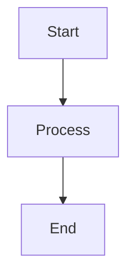
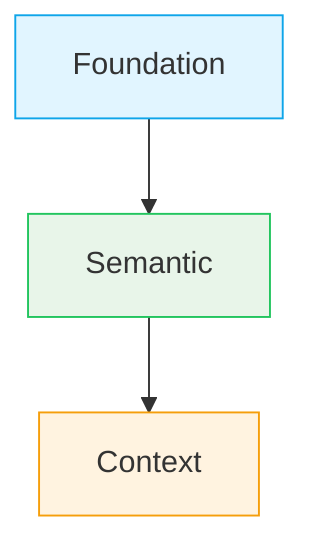

# Architectural Decision Records (ADR)

This directory contains Architectural Decision Records (ADR) for Envy UI v2. ADRs document significant architectural decisions, their context, rationale, and consequences.

## Template

When creating a new ADR, use the template: [`ADR-TEMPLATE.md`](./ADR-TEMPLATE.md)

## Adding a New ADR to Storybook

When a new ADR is created, follow these steps to add it to Storybook:

### Step 1: Create ADR File

Create the ADR markdown file in `docs/adr/` following the template:

```
docs/adr/ADR-XXXX-descriptive-title.md
```

### Step 2: Create Storybook Story

Create a story file in `stories/docs/adr/`:

**File:** `stories/docs/adr/adr-XXXX.stories.tsx`

**Template:**
```typescript
import type { Meta, StoryObj } from '@storybook/react';
import { AdrViewer } from '../../viewers/docs/AdrViewer';

type Story = StoryObj;

const meta: Meta = {
  title: 'Docs/ADR',
  parameters: { layout: 'fullscreen' },
  tags: ['autodocs']
};

export default meta;

export const [StoryName]: Story = {
  name: 'ADR-XXXX [ADR Title]',
  render: () => (
    <AdrViewer
      adrNumber="XXXX"
      title="[ADR Title]"
      status="[Status]"
      date="[YYYY-MM-DD]"
    />
  )
};
```

**Example:**
```typescript
export const StorybookModelasAIAgentOrientedArchitectureLayer: Story = {
  name: 'ADR-0022 Storybook Model as AI-Agent-Oriented Architecture Layer',
  render: () => (
    <AdrViewer
      adrNumber="0022"
      title="Storybook Model as AI-Agent-Oriented Architecture Layer"
      status="Proposed (Exploratory)"
      date="2025-12-25"
    />
  )
};
```

**Note:** All ADR stories use the same `title: 'ADR'` to group them together. The full ADR name (number + topic) is shown in the `name` field, which appears directly in Storybook navigation without intermediate folders.

### Step 3: Add to ADR List

Add the new ADR to the `adrs` array in `stories/docs/adr/00-adr-overview.stories.tsx`:

```typescript
const adrs = [
  // ... existing ADRs
  { 
    number: 'XXXX', 
    title: '[ADR Title]', 
    status: '[Status]', 
    date: '[YYYY-MM-DD]' 
  }
];
```

**Note:** The status should match exactly as it appears in the ADR file (e.g., "Accepted", "Exploratory", "Proposed (Exploratory)").

### Step 4: Update Status Badge Styles (if needed)

If the ADR uses a new status that doesn't have a badge style, add it to the `getStatusStyle` function in `00-adr-overview.stories.tsx`:

```typescript
case 'new-status':
  return { ...base, background: '#color', color: '#text-color' };
```

## Storybook Navigation Structure

ADRs are organized in Storybook as follows:

```
ADR/
├── ADR Overview (list of all ADRs - appears first)
├── ADR-0001 React Aria as Headless Accessibility Foundation
├── ADR-0002 Data-Driven Storybook Pipeline via Style Dictionary
├── ADR-0003 Data-Driven Figma Variables Pipeline via Adapter JSON
└── ... (all other ADRs at the same level)
```

All ADR stories use `title: 'ADR'` to group them together. Each ADR appears as a direct link with its full name (number + topic) in the `name` field. "ADR Overview" appears first in the list (due to file naming `00-adr-overview.stories.tsx`). There are no intermediate folders - just click on an ADR name to open it.

## Adding Images to ADRs

You can include images in ADR documents. Images are stored alongside the markdown files and automatically copied to Storybook.

### How to Add Images

1. **Place images in `docs/adr/` directory** alongside your ADR markdown file:
   ```
   docs/adr/
   ├── ADR-0001-react-aria-headless.md
   ├── ADR-0001-diagram.png          ← Image for ADR-0001
   └── ADR-0001-architecture.svg     ← Another image for ADR-0001
   ```

2. **Reference images in markdown** using relative paths:
   ```markdown
   
   
   
   ```

3. **Images are automatically copied** to `public/docs/adr/` when you run:
   ```bash
   npm run docs:copy
   ```
   Or automatically when running Storybook:
   ```bash
   npm run storybook
   ```

### Supported Image Formats

- PNG (`.png`)
- JPEG (`.jpg`, `.jpeg`)
- GIF (`.gif`)
- SVG (`.svg`)
- WebP (`.webp`)

### Image Paths in Markdown

- Use relative paths: `./ADR-XXXX-image.png`
- Images are served from `/docs/adr/` in Storybook
- ReactMarkdown will automatically render images in the ADR viewer

**Note:** You don't need to embed images directly in Storybook stories. Simply reference them in the markdown file, and they will be displayed automatically when the ADR is viewed.

## Mermaid Diagrams in ADRs

ADRs can include Mermaid diagrams for visualizing architecture, flows, and relationships. Follow these principles to ensure diagrams are readable and consistent with document text.

### Diagram Orientation

**Always use vertical orientation (top-to-bottom):**
- Use `graph TD` (Top Down) instead of `graph LR` (Left Right)
- Vertical diagrams are more readable in narrow windows and on screens
- They align better with document flow (reading top-to-bottom)

**Example:**


### Font and Node Sizing Principles

**Diagrams must match document text size:**
- Font size: **14px** (matches document body text)
- Node sizes should be compact, not oversized
- Diagrams should integrate seamlessly with surrounding text
- Avoid giant blocks that dominate the page

**Guidelines:**
- Keep node labels concise (prefer short text over long descriptions)
- Use `<br/>` for line breaks within nodes if needed, but keep total height reasonable
- Node padding is automatically reduced for compact appearance
- Spacing between nodes is optimized for readability without excessive whitespace

### Diagram Styling

**Use consistent color scheme:**
- Foundation/Semantic: `#e1f5ff` (light blue)
- Context: `#fff3e0` (light orange) or `#e8f5e9` (light green)
- Theme: `#f3e8ff` (light purple)
- Component: `#fce7f3` (light pink)

**Example with styling:**


### Diagram Types

**Supported diagram types:**
- `graph TD` - Flowcharts (vertical, preferred)
- `sequenceDiagram` - Sequence diagrams
- `stateDiagram-v2` - State diagrams
- Other Mermaid diagram types as needed

### Best Practices

1. **Keep diagrams focused**: One diagram per concept or relationship
2. **Use descriptive labels**: But keep them concise
3. **Center diagrams**: They are automatically centered in the document
4. **Test readability**: Ensure diagrams are readable at document text size
5. **Avoid over-styling**: Use colors purposefully, not decoratively

### Technical Details

- Diagrams are rendered using Mermaid.js
- Font size is automatically set to 14px to match document text
- Node sizes are optimized for compact appearance
- Diagrams are responsive and adapt to container width
- SVG output ensures crisp rendering at any zoom level

## ADR Status Values

Common status values:
- **Accepted** - Decision has been accepted and implemented
- **Exploratory** - Decision is being explored, not yet finalized
- **Proposed (Exploratory)** - Decision is proposed and in exploratory phase
- **Superseded** - Decision has been superseded by a later ADR

## Related Files

- **Template:** `docs/adr/ADR-TEMPLATE.md`
- **Storybook Overview:** `stories/docs/overview.stories.tsx`
- **ADR List:** `stories/docs/adr/00-adr-overview.stories.tsx`
- **ADR Viewer Component:** `stories/viewers/docs/AdrViewer.tsx`
- **System Manifest:** `system.manifest.json` (includes Docs in navigationOrder)

## Notes for AI Agents

When creating a new ADR:
1. Always use the template from `ADR-TEMPLATE.md`
2. Follow the existing ADR structure and style
3. Use impersonal language (avoid "we", "I" - use "This ADR establishes", "The system", etc.)
4. Include Related ADRs section with proper markdown links
5. Set the correct date (use current date, not placeholder)
6. **Use the script to generate stories:** Run `node scripts/generate-adr-stories.mjs` to automatically generate/update all ADR story files
7. Add the ADR to the list in `00-adr-overview.stories.tsx` (if not using the script)
8. Ensure status badge styling exists for the status used
9. **For images:** Place image files in `docs/adr/` and reference them with relative paths in markdown (e.g., ``)
10. **For Mermaid diagrams:**
    - Always use `graph TD` (vertical orientation) instead of `graph LR`
    - Keep font sizes and node sizes compact to match document text (14px)
    - Use consistent color scheme for visual consistency
    - Keep node labels concise
    - Test readability at document text size

