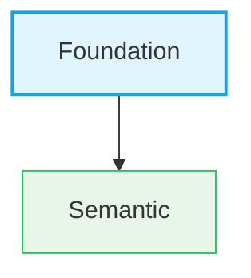

# ADR Workflow

Complete guide to writing and managing Architectural Decision Records (ADR) in Envy UI v2.

## Overview

ADRs document significant architectural decisions, their context, rationale, and consequences. They serve as a historical record of architectural thinking, not as current system documentation.

## Single Source of Truth

**⚠️ CRITICAL:** `stories/viewers/docs/adr-list-data.ts` is the **SINGLE SOURCE OF TRUTH** for all ADR metadata.

All ADR metadata must be defined here FIRST:
- Number, title, status, date
- **exportName** (recommended for reliable linking)

**Workflow:**
1. Update `adr-list-data.ts` FIRST
2. Create/update ADR markdown file
3. Run `npm run adr:generate` (reads from adr-list-data.ts)
4. Run `npm run adr:validate` (verifies consistency)

**Why this matters:**
- Prevents broken links in overview page
- Ensures consistency between story files and links
- Makes it impossible to have mismatched exportName
- Provides reliable navigation in Storybook

**For detailed agent instructions, see:** [`docs/adr/AGENT-GUIDE.md`](../adr/AGENT-GUIDE.md)

## ADR Principles

### What ADRs Are

- Historical record of architectural thinking
- Context for understanding why approaches were explored
- Reference material for reflection and analysis

### What ADRs Are NOT

- Current system documentation
- Authoritative description of present architecture
- Executable instructions for implementation

## Creating a New ADR

### Step 1: Use the Template

Always use the template: `docs/adr/ADR-TEMPLATE.md`

**File naming:**
```
docs/adr/ADR-XXXX-descriptive-title.md
```

**Example:**
```
docs/adr/ADR-0027-figma-migration-strategy.md
```

### Step 2: Fill in the Template

**Required sections:**
- Status (Accepted, Proposed, Exploratory, Superseded)
- Date (YYYY-MM-DD)
- Owner
- Related ADRs (with markdown links)
- Context
- Decision
- Rationale
- Consequences

**Language:**
- Use impersonal language
- Avoid "we", "I" - use "This ADR establishes", "The system", etc.

### Formatting Rules

**Critical: Header section formatting must be exact:**

1. **Field order (required):**
   - `**Status:**` - Must be on its own line with 2 trailing spaces
   - `**Date:**` - Must be on its own line with 2 trailing spaces
   - `**Owner:**` - Must be on its own line with 2 trailing spaces
   - `**Assistance:**` - Optional, but recommended. Must end with 2 trailing spaces
   - `**Related:**` - Must be on its own line with 2 trailing spaces, followed by blank line

2. **Correct format example:**
   ```markdown
   **Status:** Accepted  
   **Date:** 2025-12-15  
   **Owner:** Eugene Goncharov  
   **Assistance:** AI-assisted drafting (human-reviewed)  
   **Related:**  

   - [ADR-0001](../adr/ADR-0001-react-aria-headless.md) — React Aria as Headless Accessibility Foundation  
   - [ADR-0002](../adr/ADR-0002-data-driven-storybook-pipeline.md) — Data-Driven Storybook Pipeline
   ```

3. **Common formatting errors (avoid):**
   - ❌ `**Related:** [ADR-0001](./file.md) (description)` - Single line format
   - ❌ `**Related ADRs:**` - Wrong field name (should be `**Related:**`)
   - ❌ Using `*` instead of `-` for list markers
   - ❌ Missing trailing spaces (breaks markdown line breaks)
   - ❌ Missing blank line after `**Related:**`
   - ❌ Using parentheses `()` instead of em-dash `—` for descriptions

4. **Related field rules:**
   - **Field name:** Always use `**Related:**` (not "Related ADRs" or other variants)
   - **Format:** Multi-line list with `-` markers (not `*`)
   - **Link format:** `- [ADR-XXXX](./ADR-XXXX-title.md) — Title`
   - **Separator:** Use em-dash `—` (not hyphen `-` or parentheses `()`)
   - **Trailing spaces:** Each line should end with 2 spaces for markdown line breaks
   - **Blank line:** Must have blank line after `**Related:**` before list items

5. **Why trailing spaces matter:**
   - Markdown requires 2 trailing spaces for line breaks
   - Without them, fields run together on the same line
   - Validation script checks for this automatically

### Step 3: Add to adr-list-data.ts

**CRITICAL:** Add entry to `stories/viewers/docs/adr-list-data.ts` FIRST:

```typescript
// In stories/viewers/docs/adr-list-data.ts
{ 
  number: '0030', 
  title: 'Your ADR Title', 
  status: 'Accepted', 
  date: '2025-01-02',
  exportName: 'YourAdrTitle' // Recommended: ensures reliable linking
}
```

**exportName rules:**
- Remove all non-alphanumeric characters from title
- Remove all spaces
- Example: "Token Organization - Context" → `TokenOrganizationContext`

### Step 4: Generate Storybook Stories

**Use script (required):**
```bash
npm run adr:generate
```

This script:
- Reads `adr-list-data.ts` for exportName (single source of truth)
- Generates story file with correct export name
- Ensures links work correctly

**Option B: Manual (not recommended):**

1. Create story file: `stories/docs/adr/adr-XXXX.stories.tsx`

```typescript
import type { Meta, StoryObj } from '@storybook/react';
import { AdrViewer } from '../../viewers/docs/AdrViewer';

const meta: Meta = {
  title: 'Docs/ADR',
  parameters: { layout: 'fullscreen' },
  tags: ['autodocs']
};

export default meta;
type Story = StoryObj;

export const [StoryName]: Story = {
  name: 'ADR-XXXX [ADR Title]',
  render: () => (
    <AdrViewer
      adrNumber="XXXX"
      title="[ADR Title]"
      status="[Status]"
      date="[YYYY-MM-DD]"
    />
  )
};
```

2. **Note:** ADR list is now managed in `stories/viewers/docs/adr-list-data.ts` (single source of truth). The overview page reads from this file automatically.

## ADR Status Values

Common status values:
- **Accepted** - Decision has been accepted and implemented
- **Exploratory** - Decision is being explored, not yet finalized
- **Proposed (Exploratory)** - Decision is proposed and in exploratory phase
- **Superseded** - Decision has been superseded by a later ADR

## Adding Images to ADRs

1. **Place images in `docs/adr/` directory:**
   ```
   docs/adr/
   ├── ADR-0025-diagram.png
   └── ADR-0025-architecture.svg
   ```

2. **Reference in markdown:**
   ```markdown
   
   ```

3. **Images are automatically copied** when running:
   ```bash
   npm run docs:copy
   ```

**Supported formats:** PNG, JPEG, GIF, SVG, WebP

## Mermaid Diagrams in ADRs

### CRITICAL Syntax Rules

**To prevent rendering errors, follow these rules EXACTLY:**

1. **Stroke width syntax:**
   - ✅ CORRECT: `stroke-width:2px` (with hyphen)
   - ❌ WRONG: `strokeWidth:2px` (camelCase)
   - ❌ WRONG: `strokeWidth:2` (missing unit)

2. **Node labels:**
   - ✅ CORRECT: `A["Label with spaces"]` (quotes required)
   - ✅ CORRECT: `A[SimpleLabel]` (quotes optional if no spaces)
   - ❌ WRONG: `A[Label with spaces]` (no quotes with spaces)

3. **Orientation:**
   - ✅ CORRECT: `graph TD` (Top Down - vertical)
   - ❌ WRONG: `graph LR` (Left Right - horizontal)

4. **Complete example:**
   ```mermaid
   graph TD
       A["Token System<br/>tokens/{context}/"] --> B["Figma Files"]
       
       style A fill:#e1f5ff,stroke:#0ea5e9,stroke-width:2px
       style B fill:#f3e8ff,stroke:#a855f7
   ```

### Testing Before Commit

**Always test Mermaid diagrams:**
1. Copy diagram code to [Mermaid Live Editor](https://mermaid.live)
2. Verify it renders correctly
3. Check for syntax errors
4. Only then commit to ADR

### Font and Node Sizing

**Diagrams must match document text size:**
- Font size: **14px** (matches document body text)
- Node sizes should be compact
- Diagrams should integrate seamlessly with text

### Styling

**Use consistent color scheme:**
- Foundation/Semantic: `#e1f5ff` (light blue)
- Context: `#fff3e0` (light orange) or `#e8f5e9` (light green)
- Theme: `#f3e8ff` (light purple)
- Component: `#fce7f3` (light pink)

**Example:**


### Common Errors

| Error | Cause | Fix |
|-------|-------|-----|
| Diagram not rendering | `strokeWidth` instead of `stroke-width` | Use hyphen format |
| Node labels broken | Missing quotes around labels with spaces | Add quotes: `A["Label"]` |
| Diagram too wide | Using `graph LR` | Use `graph TD` |
| Syntax error | Invalid Mermaid syntax | Test in Mermaid Live Editor |

### Best Practices

1. Keep diagrams focused: One diagram per concept
2. Use descriptive labels: But keep them concise
3. Center diagrams: They are automatically centered
4. Test readability: Ensure readable at document text size
5. Avoid over-styling: Use colors purposefully

## Storybook Navigation

ADRs are organized in Storybook:

```
Docs/ADR/
├── ADR Overview (list of all ADRs - appears first)
├── ADR-0001 React Aria as Headless Accessibility Foundation
├── ADR-0002 Data-Driven Storybook Pipeline
└── ... (all other ADRs at the same level)
```

All ADR stories use `title: 'Docs/ADR'` to group them together.

## Related Files

- **Template:** `docs/adr/ADR-TEMPLATE.md`
- **ADR List:** `stories/docs/adr/00-adr-overview.stories.tsx`
- **ADR Viewer:** `stories/viewers/docs/AdrViewer.tsx`
- **Story Generator:** `scripts/generate-adr-stories.mjs`

## Common Pitfalls and Validation Checklist

### After Creating a New ADR

**Required Steps (in order):**

1. **Add to adr-list-data.ts FIRST (SINGLE SOURCE OF TRUTH):**
   - ✅ Add entry to `stories/viewers/docs/adr-list-data.ts`
   - Format: `{ number: 'XXXX', title: 'Title', status: 'Status', date: 'YYYY-MM-DD', exportName: 'ExportName' }`
   - **exportName:** Convert title to PascalCase (remove spaces, special chars)
   - Example: "Token Organization - Context" → `TokenOrganizationContext`

2. **Create ADR file:**
   - ✅ File name: `ADR-XXXX-descriptive-title.md`
   - ✅ File location: `docs/adr/`
   - ✅ Uses template from `ADR-TEMPLATE.md`
   - ✅ Header format: `# ADR-XXXX: Title` (exact match)

3. **Update filename mapping:**
   - ✅ Add entry to `stories/viewers/docs/adr-filename-map.ts`
   - Format: `"XXXX": "ADR-XXXX-descriptive-title.md"`
   - **Auto-generate:** Run the command in the file's comment, or manually add

4. **Generate Storybook stories:**
   - ✅ Run: `npm run adr:generate`
   - ✅ Script reads `adr-list-data.ts` for exportName
   - ✅ Verify story file created: `stories/docs/adr/adr-XXXX.stories.tsx`

5. **Validate:**
   - ✅ Run: `npm run adr:validate`
   - ✅ Checks exportName matches story file
   - ✅ Fix any errors or warnings

6. **Verify in Storybook:**
   - ✅ ADR appears in "Docs/ADR" section
   - ✅ ADR loads without errors
   - ✅ Overview page link works
   - ✅ Mermaid diagrams render correctly
   - ✅ Links to other ADRs work

### File Naming Consistency

**Critical: File name must match exactly:**

- ADR file: `ADR-0027-figma-files-structure-and-organization.md`
- Story file: `adr-0027.stories.tsx` (lowercase, no title)
- Filename map: `"0027": "ADR-0027-figma-files-structure-and-organization.md"`
- ADR list: `number: '0027'` (4 digits with leading zeros)

**Mismatch causes:**
- ❌ ADR not loading in Storybook
- ❌ 404 errors when viewing ADR
- ❌ Broken links between ADRs

### Link Validation

**When adding links to other ADRs:**

1. **Format:**
   ```markdown
   - [ADR-XXXX](./ADR-XXXX-descriptive-title.md) — Title
   ```

2. **Check:**
   - ✅ File exists: `docs/adr/ADR-XXXX-descriptive-title.md`
   - ✅ Link uses relative path: `./ADR-XXXX-...`
   - ✅ Title matches actual ADR title

3. **In Related section:**
   - List all referenced ADRs
   - Use consistent format with em-dash separator

### Quick Validation Script

After creating a new ADR, run this checklist:

```bash
# 1. Check file exists
ls docs/adr/ADR-XXXX-*.md

# 2. Check filename mapping
grep "XXXX" stories/viewers/docs/adr-filename-map.ts

# 3. Check ADR list
grep "XXXX" stories/viewers/docs/adr-list-data.ts

# 4. Check story file
ls stories/docs/adr/adr-XXXX.stories.tsx

# 5. Generate/regenerate stories
npm run adr:generate

# 6. Validate everything
npm run adr:validate

# 7. Test Mermaid syntax (manual check in Storybook)
```

### Troubleshooting

**ADR not loading:**
1. Check `adr-filename-map.ts` has correct entry
2. Verify file name matches exactly (case-sensitive)
3. Check Storybook console for errors
4. Verify `docs/` is in `staticDirs` in `.storybook/main.ts`
5. Run `npm run adr:validate` to check for issues

**Mermaid not rendering:**
1. Check syntax: use `stroke-width` (with hyphen)
2. Verify quotes around node labels
3. Test in [Mermaid Live Editor](https://mermaid.live)
4. Check browser console for Mermaid errors

**Links broken:**
1. Verify target ADR file exists
2. Check relative path format: `./ADR-XXXX-...`
3. Verify file name matches exactly

## Notes for AI Agents

When creating a new ADR:

1. **CRITICAL:** Update `stories/viewers/docs/adr-list-data.ts` FIRST (single source of truth)
   - Add entry with number, title, status, date, exportName
   - exportName: Remove all non-alphanumeric chars and spaces from title
2. Always use the template from `ADR-TEMPLATE.md`
3. Follow existing ADR structure and style
4. Use impersonal language
5. Include Related ADRs section with proper markdown links
6. Set the correct date (use current date)
7. **Use the script:** `npm run adr:generate` (reads from adr-list-data.ts)
8. **Validate:** `npm run adr:validate` (checks exportName matches)
9. For images: Place in `docs/adr/` and reference with relative paths
10. For Mermaid diagrams:
    - Always use `graph TD` (vertical orientation)
    - Use `stroke-width:2px` (with hyphen, NOT `strokeWidth`)
    - Use quotes around node labels: `A["Label"]`
    - Test in Mermaid Live Editor before committing
    - Keep font sizes compact (14px)
    - Use consistent color scheme
    - Keep node labels concise

**For complete agent workflow, see:** [`docs/adr/AGENT-GUIDE.md`](../adr/AGENT-GUIDE.md)

