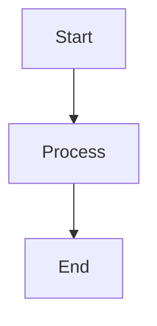
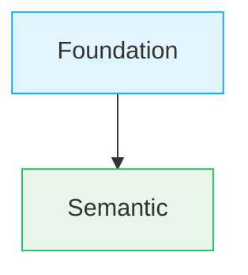

# ADR Workflow

Complete guide to writing and managing Architectural Decision Records (ADR) in Envy UI v2.

## Overview

ADRs document significant architectural decisions, their context, rationale, and consequences. They serve as a historical record of architectural thinking, not as current system documentation.

## ADR Principles

### What ADRs Are

- Historical record of architectural thinking
- Context for understanding why approaches were explored
- Reference material for reflection and analysis

### What ADRs Are NOT

- Current system documentation
- Authoritative description of present architecture
- Executable instructions for implementation

## Creating a New ADR

### Step 1: Use the Template

Always use the template: `docs/adr/ADR-TEMPLATE.md`

**File naming:**
```
docs/adr/ADR-XXXX-descriptive-title.md
```

**Example:**
```
docs/adr/ADR-0027-figma-migration-strategy.md
```

### Step 2: Fill in the Template

**Required sections:**
- Status (Accepted, Proposed, Exploratory, Superseded)
- Date (YYYY-MM-DD)
- Owner
- Related ADRs (with markdown links)
- Context
- Decision
- Rationale
- Consequences

**Language:**
- Use impersonal language
- Avoid "we", "I" - use "This ADR establishes", "The system", etc.

### Step 3: Add to Storybook

**Option A: Use script (recommended):**
```bash
node scripts/generate-adr-stories.mjs
```

**Option B: Manual:**

1. Create story file: `stories/docs/adr/adr-XXXX.stories.tsx`

```typescript
import type { Meta, StoryObj } from '@storybook/react';
import { AdrViewer } from '../../viewers/docs/AdrViewer';

const meta: Meta = {
  title: 'Docs/ADR',
  parameters: { layout: 'fullscreen' },
  tags: ['autodocs']
};

export default meta;
type Story = StoryObj;

export const [StoryName]: Story = {
  name: 'ADR-XXXX [ADR Title]',
  render: () => (
    <AdrViewer
      adrNumber="XXXX"
      title="[ADR Title]"
      status="[Status]"
      date="[YYYY-MM-DD]"
    />
  )
};
```

2. Add to ADR list: `stories/docs/adr/00-adr-overview.stories.tsx`

```typescript
const adrs = [
  // ... existing ADRs
  { 
    number: 'XXXX', 
    title: '[ADR Title]', 
    status: '[Status]', 
    date: '[YYYY-MM-DD]' 
  }
];
```

## ADR Status Values

Common status values:
- **Accepted** - Decision has been accepted and implemented
- **Exploratory** - Decision is being explored, not yet finalized
- **Proposed (Exploratory)** - Decision is proposed and in exploratory phase
- **Superseded** - Decision has been superseded by a later ADR

## Adding Images to ADRs

1. **Place images in `docs/adr/` directory:**
   ```
   docs/adr/
   ├── ADR-0025-diagram.png
   └── ADR-0025-architecture.svg
   ```

2. **Reference in markdown:**
   ```markdown
   
   ```

3. **Images are automatically copied** when running:
   ```bash
   npm run docs:copy
   ```

**Supported formats:** PNG, JPEG, GIF, SVG, WebP

## Mermaid Diagrams in ADRs

### Orientation

**Always use vertical orientation:**
- Use `graph TD` (Top Down) instead of `graph LR` (Left Right)
- Vertical diagrams are more readable

**Example:**


### Font and Node Sizing

**Diagrams must match document text size:**
- Font size: **14px** (matches document body text)
- Node sizes should be compact
- Diagrams should integrate seamlessly with text

### Styling

**Use consistent color scheme:**
- Foundation/Semantic: `#e1f5ff` (light blue)
- Context: `#fff3e0` (light orange) or `#e8f5e9` (light green)
- Theme: `#f3e8ff` (light purple)
- Component: `#fce7f3` (light pink)

**Example:**


### Best Practices

1. Keep diagrams focused: One diagram per concept
2. Use descriptive labels: But keep them concise
3. Center diagrams: They are automatically centered
4. Test readability: Ensure readable at document text size
5. Avoid over-styling: Use colors purposefully

## Storybook Navigation

ADRs are organized in Storybook:

```
Docs/ADR/
├── ADR Overview (list of all ADRs - appears first)
├── ADR-0001 React Aria as Headless Accessibility Foundation
├── ADR-0002 Data-Driven Storybook Pipeline
└── ... (all other ADRs at the same level)
```

All ADR stories use `title: 'Docs/ADR'` to group them together.

## Related Files

- **Template:** `docs/adr/ADR-TEMPLATE.md`
- **ADR List:** `stories/docs/adr/00-adr-overview.stories.tsx`
- **ADR Viewer:** `stories/viewers/docs/AdrViewer.tsx`
- **Story Generator:** `scripts/generate-adr-stories.mjs`

## Notes for AI Agents

When creating a new ADR:

1. Always use the template from `ADR-TEMPLATE.md`
2. Follow existing ADR structure and style
3. Use impersonal language
4. Include Related ADRs section with proper markdown links
5. Set the correct date (use current date)
6. **Use the script:** `node scripts/generate-adr-stories.mjs`
7. For images: Place in `docs/adr/` and reference with relative paths
8. For Mermaid diagrams:
   - Always use `graph TD` (vertical orientation)
   - Keep font sizes compact (14px)
   - Use consistent color scheme
   - Keep node labels concise

